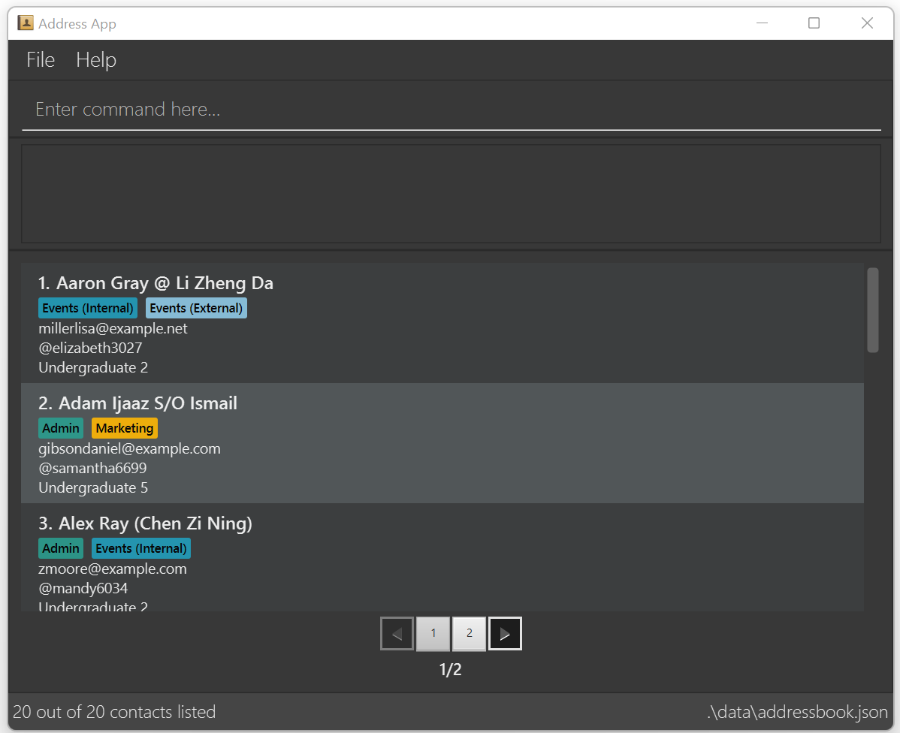

* Data CoNdUctorS is a desktop application for administrative director of CCAs (Co-Curricular Activities) who has to manage and access database of the members.
* It allows users to efficiently and easily manage and access large CCA membership database (including creation, edit, and deletion of data entries)
* For the detailed documentation of this project, see the [Data CoNdUctorS Product Website](https://ay2425s1-cs2103-f09-1.github.io/tp).
* This project is based on the AddressBook-Level3 project created by the [SE-EDU initiative](https://se-education.org).
