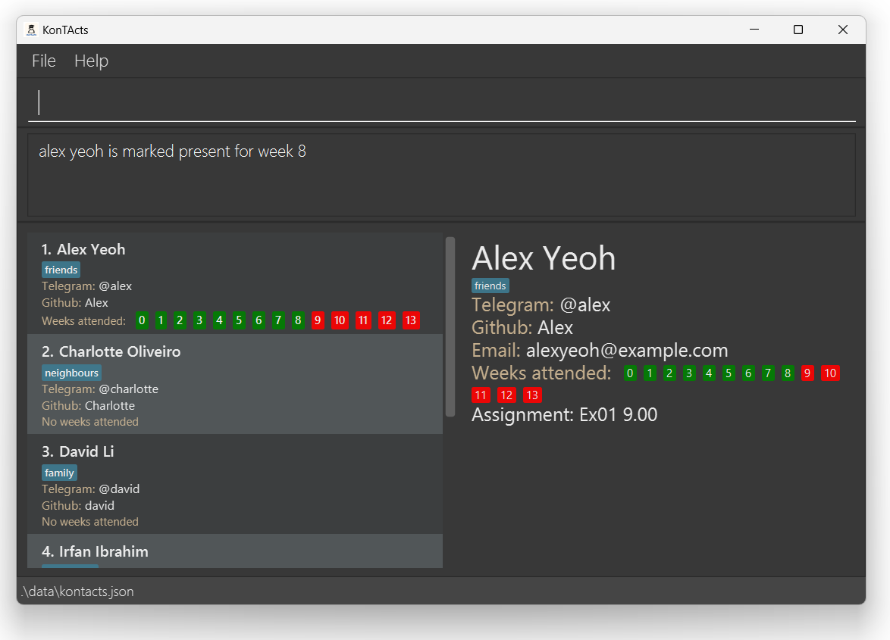

By CS2103T-T11-2

**KonTActs is a desktop application for CS2030S teaching assistants to manage your students', fellow TAs', and professors' contact details.** While it has a GUI, most of the user interactions happen using a CLI (Command Line Interface).

Build as part of **a project for CS2030S TAs**. 
  Users will be able to use KonTActs:
  * as a reference to get their students' details more easily
  * as a tool to help them keep track of their students.

**The project simulates an ongoing software project for a desktop application (called _konTActs_) used for managing contact details.
  * For details on how to use konTActs, please refer to the user guide for [konTActs](https://ay2425s1-cs2103t-t11-2.github.io/tp/UserGuide.html)

* If you are interested about developing KonTActs, the [Developer Guide](https://ay2425s1-cs2103t-t11-2.github.io/tp/DeveloperGuide.html) is a good place to start.

