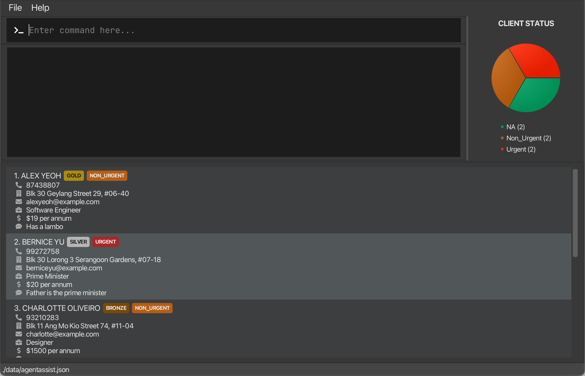

# What is VendorVault ?

---

* Vendor vault is designed to be used by small scale grocery stores who have to interact and confirm orders with multiple suppliers and keep track their inventory
* This application can be used using the command-line interface (CLI), which allows for faster inputs when compared to other text-based inputs.

---
# How did this project come about ?

---
* The project simulates an ongoing software project for a desktop application (called _AddressBook_) used for managing contact details.
  * It is **written in OOP fashion**. It provides a **reasonably well-written** code base **bigger** (around 6 KLoC) than what students usually write in beginner-level SE modules, without being overwhelmingly big.
  * It comes with a **reasonable level of user and developer documentation**.
* It is named `AddressBook Level 3` (`AB3` for short) because it was initially created as a part of a series of `AddressBook` projects (`Level 1`, `Level 2`, `Level 3` ...).

This project is based on the AddressBook-Level3 project created by the [SE-EDU initiative](https://se-education.org).