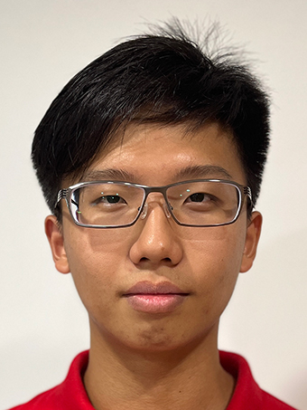
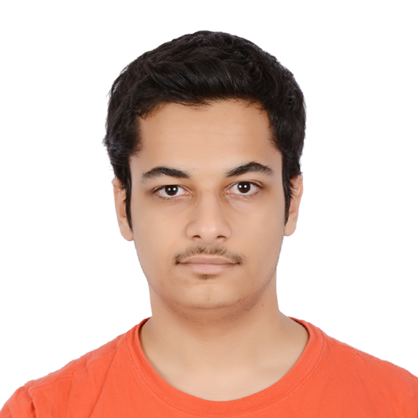
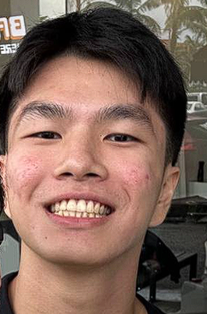
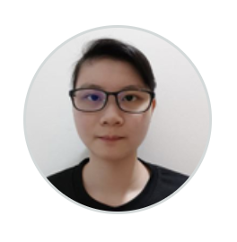
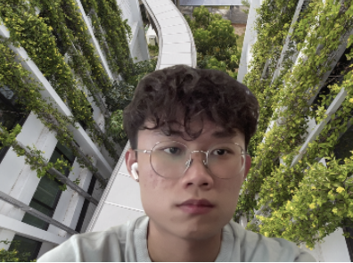

# About Us

We are a team based in the [School of Computing, National University of Singapore](http://www.comp.nus.edu.sg).

You can reach us at the email `seer[at]comp.nus.edu.sg`

## Project team

### Andrew Teoh

[[github](https://github.com/andrew22teoh)]
[[portfolio](team/andrew22teoh.md)]

* Role: Team Lead

### Abdulrahman Al Rammah

[[github](http://github.com/abdulrahmanalrammah)]
[[portfolio](team/abdulrahmanalrammah.md)]

* Role: Developer
* Responsibilities: Documentation

### Rayner Lim Fang Yuh

[[github](http://github.com/rayray39)]
[[portfolio](team/johndoe.md)]

* Role: Developer
* Responsibilities: UI

### Rachael Chan

[[github](http://github.com/rachael-chan)]
[[portfolio](team/rachaelchan.md)]

* Role: Software Engineer
* Responsibilities: In charge of `Model`

### Liau Zhan Yi

[[github](https://github.com/liauzhanyi)]
[[portfolio](team/liauzhanyi.md)]

* Role: Integration
