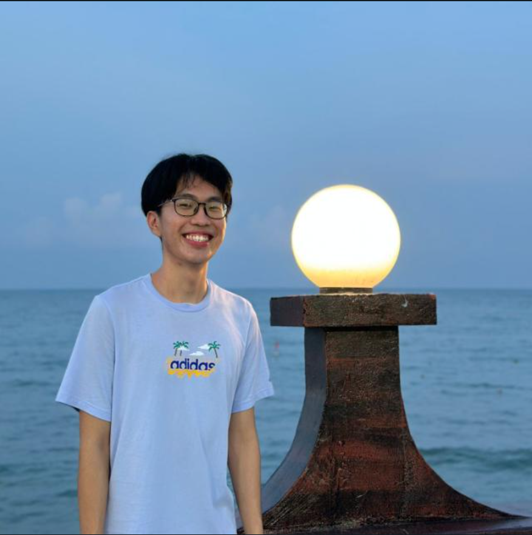
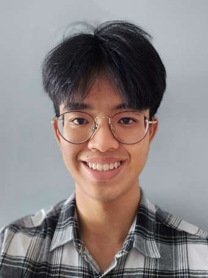
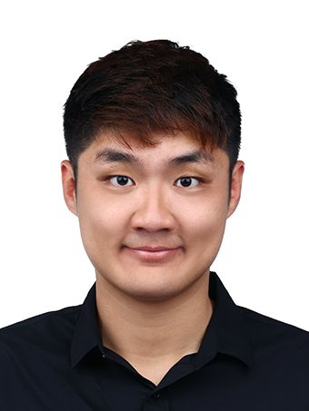

# About Us

We are a team based in the [School of Computing, National University of Singapore](http://www.comp.nus.edu.sg).

You can reach us at CS2103T F09 group 3!

## Project team
Here are the members of our team! 

### Tan Yi Xuan

[[github](https://github.com/yxtan02)]
[[portfolio](team/yxtan02.md)]

* Role: Developer
* Responsibilities: Integration

### Samuel Lim

[[github](https://github.com/slye20)]
[[portfolio](team/slye20.md)]

* Role: Developer
* Responsibilities: Documentation, Testing, Code quality and many more!

### Yang Qifeng

[[github](http://github.com/YangQF2002)]
[[portfolio](qifeng.md)]

* Role: Developer 
* Responsibilities: Code quality

### Wei Bin

[[github](https://github.com/weibinlim)]
[[portfolio](team/weibin.md)]

* Role: Developer
* Responsibilities: Testing

### Hovan Leong

[[github](https://github.com/hovanleong)]
[[portfolio](team/hovanleong.md)]

* Role: Developer
* Responsibilities: Documentation
