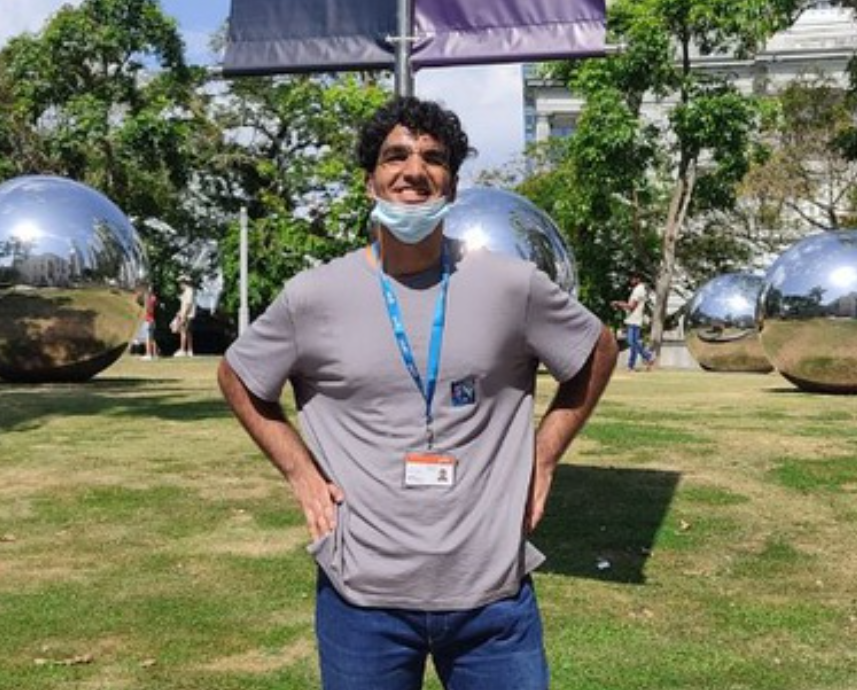

# About Us

We are a team based in the [School of Computing, National University of Singapore](http://www.comp.nus.edu.sg).

You can reach us at the email `seer[at]comp.nus.edu.sg`

## Project team

### Jeremy Chia

[[github](https://github.com/jeremychiaaaaa)]
[[portfolio](team/jeremy.md)]

* Role: Code Quality 

### Vera Koh

[[github](https://github.com/verakohh)]
[[portfolio](team/vera.md)]

* Role: Team Lead
* Responsibilities: UI

### Malhotra Arnav

[[github](https://github.com/arnav12344)] 
[[portfolio](team/arnav.md)]

* Role: Developer, Admin
* Responsibilities: Data

### Tze Cheng

[[github](http://github.com/kuiktzecheng)]
[[portfolio](team/kuiktzecheng.md)]

* Role: Developer
* Responsibilities: Dev Ops + Threading

### Chen Le

[[github](https://github.com/chenle228)]
[[portfolio](team/chenle228.md)]

* Role: Developer
* Responsibilities: Deliverables and deadlines
