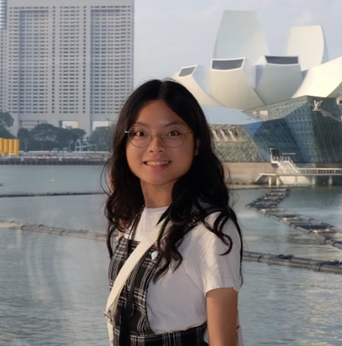
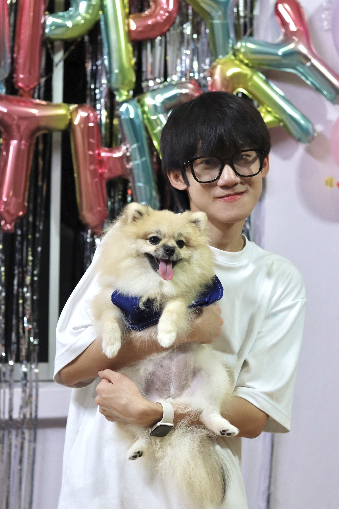
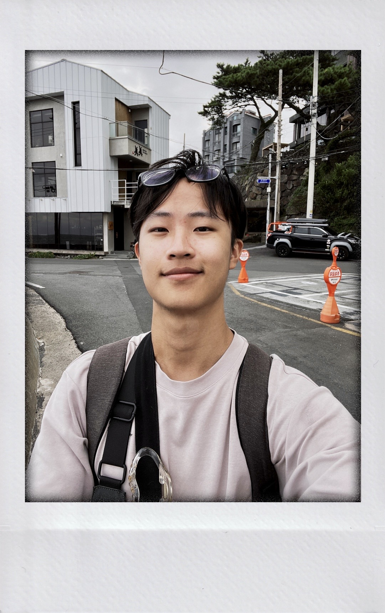
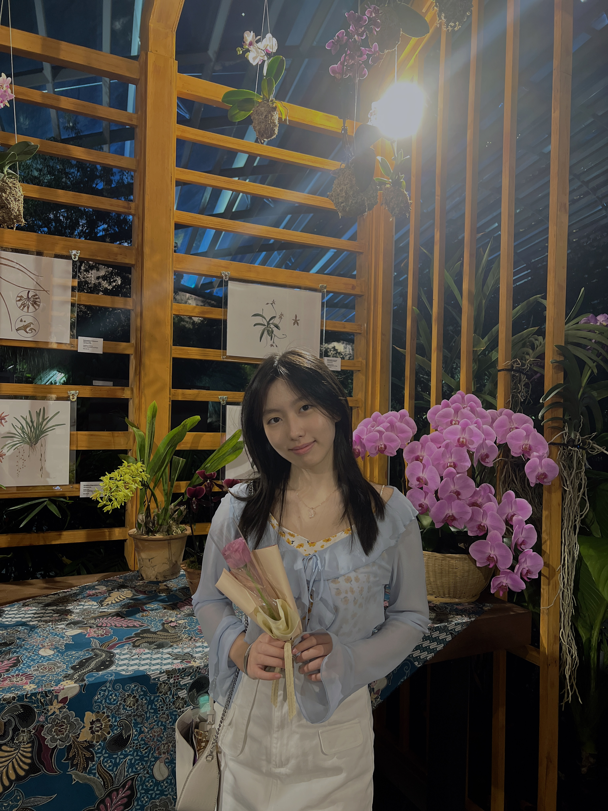

We are a team based in the [School of Computing, National University of Singapore](https://www.comp.nus.edu.sg).

You can reach us at the email `seer[at]comp.nus.edu.sg`

## Project team

### Jia Yi

[[github](http://github.com/jiayi-gallium369)]
[[portfolio](team/jiayi-gallium369.md)]

- Role: Developer
- Responsibilities: UI

### Siow Rui Ming

[[github](http://github.com/ruiming97)]
[[portfolio](team/ruiming97.md)]

- Role: Developer
- Responsibilities: Data

### Jeremy

[[github](http://github.com/limjeremy496)]
[[portfolio](team/limjeremy496.md)]

- Role: Developer
- Responsibilities: Dev Ops + Threading

### Leroy Chiu

[[github](http://github.com/leroychiu20)]
[[portfolio](team/leroychiu20.md)]

- Role: Developer
- Responsibilities: UI, Testing

### Charlene Teoh

[[github](http://github.com/charlenetcy)]
[[portfolio](team/charlene.md)]

- Role: Developer
- Responsibilities: UI, Deliverables and deadlines
