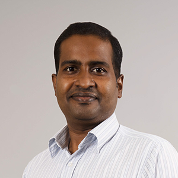
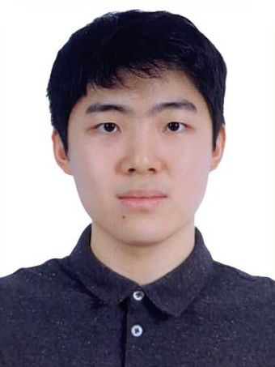
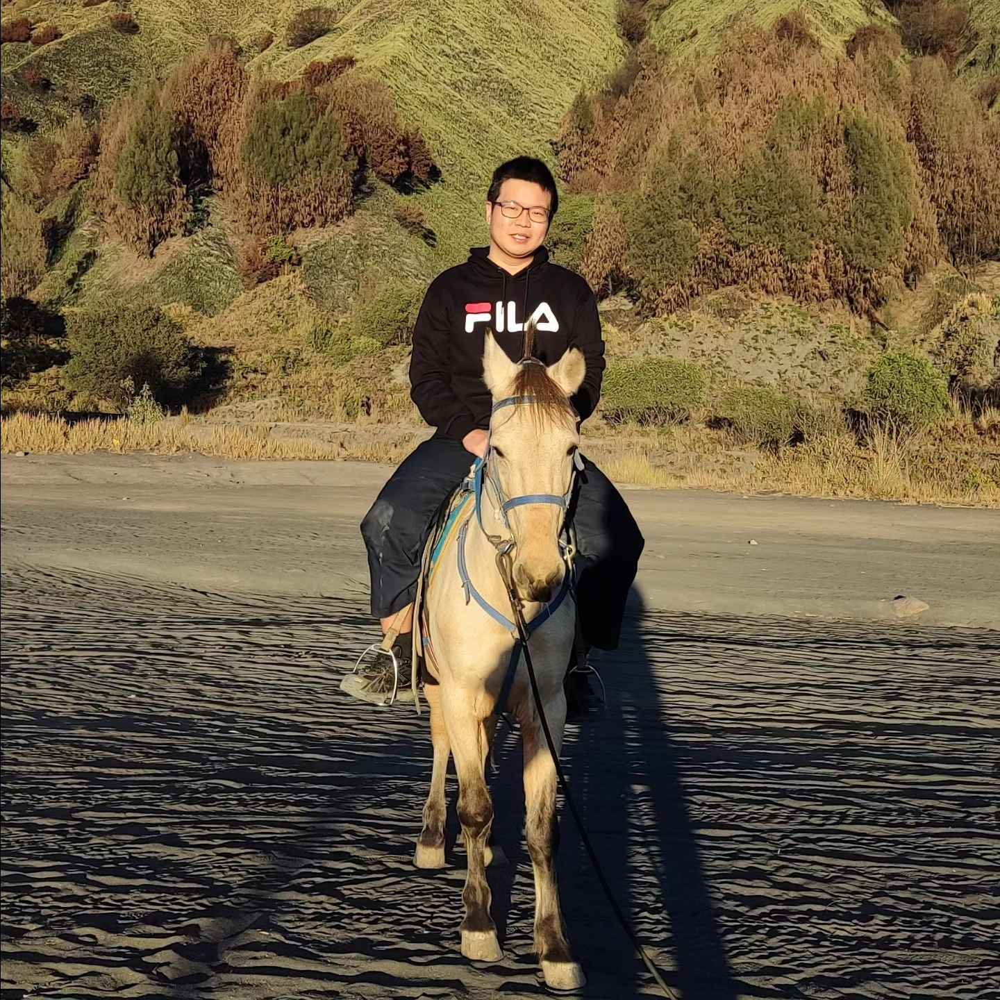

We are a team based in the [School of Computing, National University of Singapore](https://www.comp.nus.edu.sg).

You can reach us at the email `seer[at]comp.nus.edu.sg`

## Project team

### Prabhu NATARAJAN

[[homepage](https://www.comp.nus.edu.sg/cs/people/prabhu/)]
[[github](https://github.com/prabhu-na)]
[[portfolio](team/johndoe.md)]

* Role: Project Advisor

### Tan Yong Quan

[[github](http://github.com/yongqqqq)]
[[portfolio](team/johndoe.md)]

* Role: Team Lead
* Responsibilities: UI

### Isaac Lim Tzee Zac

[[github](https://github.com/isaactodo)] [[portfolio](team/johndoe.md)]

* Role: Documentation, Code Quality, Deliverables and Deadlines
* Responsibilities: Integration

### Lei Jianwen

[[github](http://github.com/jianwen0451)]
[[portfolio](team/johndoe.md)]

* Role: Developer Java Expert
* Responsibilities: Dev Ops + Threading

### Collin Tan Yu Qi

[[github](http://github.com/tanyqcollin)]
[[portfolio](team/johndoe.md)]

* Role: Developer
* Responsibilities: UI

### Tee Jing Hong

[[github](http://github.com/RadieonAjax)]
[[portfolio](team/RadieonAjax.md)]

* Role: Developer
* Responsibilities: UI
