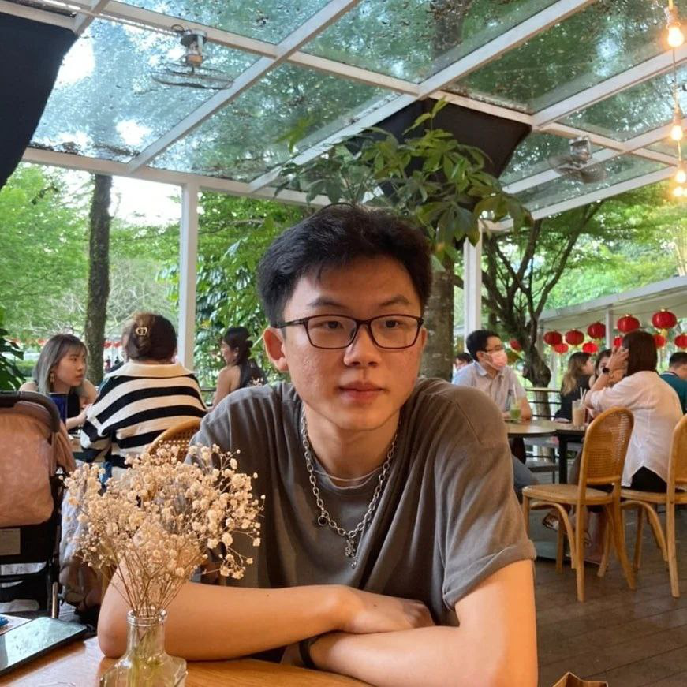
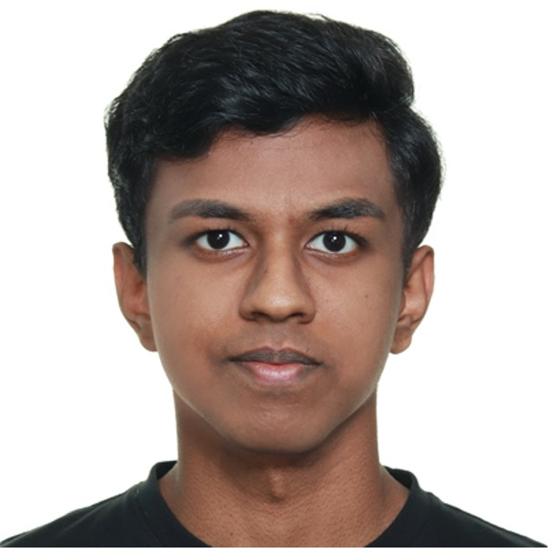
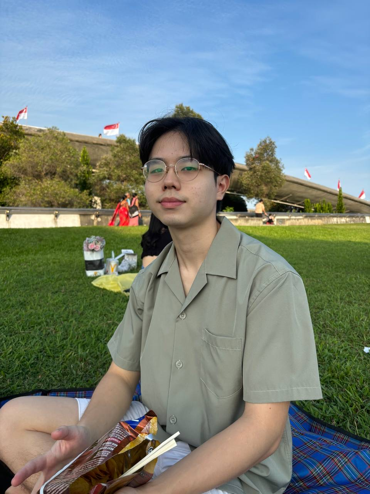
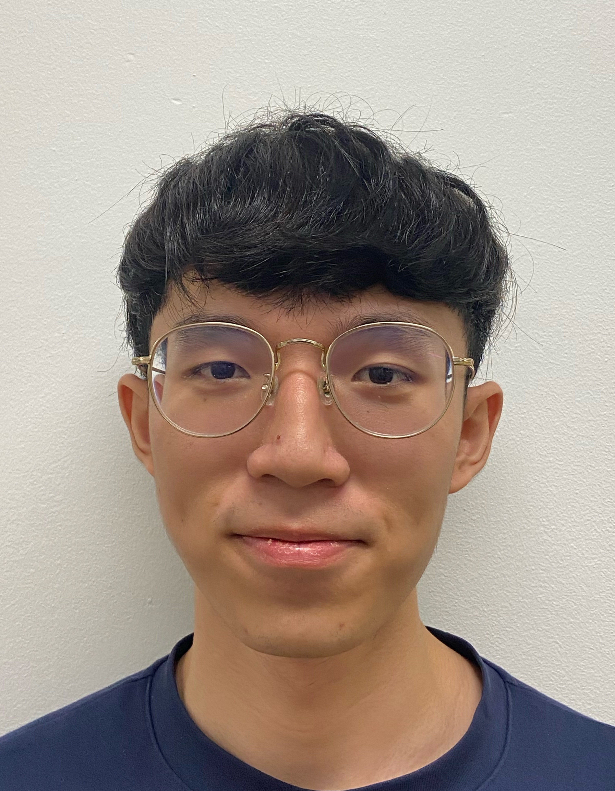

# About Us

We are a team based in the [School of Computing, National University of Singapore](http://www.comp.nus.edu.sg).

You can reach us at the email `seer[at]comp.nus.edu.sg`

## VendorVault

### Vince

[[homepage](http://www.comp.nus.edu.sg/~damithch)]
[[github](https://github.com/vinc3leong)]
[[portfolio](team/johndoe.md)]

* Role: Documentation
* Responsibilities: Responsible for the quality of various project documents.

### Krishnan Linkes Varun

[[github](http://github.com/linkesV)]
[[portfolio](team/johndoe.md)]

* Role: Code quality
* Responsibilities: Looks after code quality, ensures adherence to coding standards, etc.

### Pravein

[[github](http://github.com/prave1n)] [[portfolio](team/johndoe.md)]

* Role: Deliverables and deadlines
* Responsibilities: Ensure project deliverables are done on time and in the right format.

### Jian Yi

[[github](http://github.com/ngjianyi)]
[[portfolio](team/johndoe.md)]

* Role: Testing
* Responsibilities: Ensures the testing of the project is done properly and on time

### Chen Jianzhi

[[github](http://github.com/cjianzhi)]
[[portfolio](team/johndoe.md)]

* Role: Integration
* Responsibilities: Responsible for code versioning and integrating different parts of the software.
