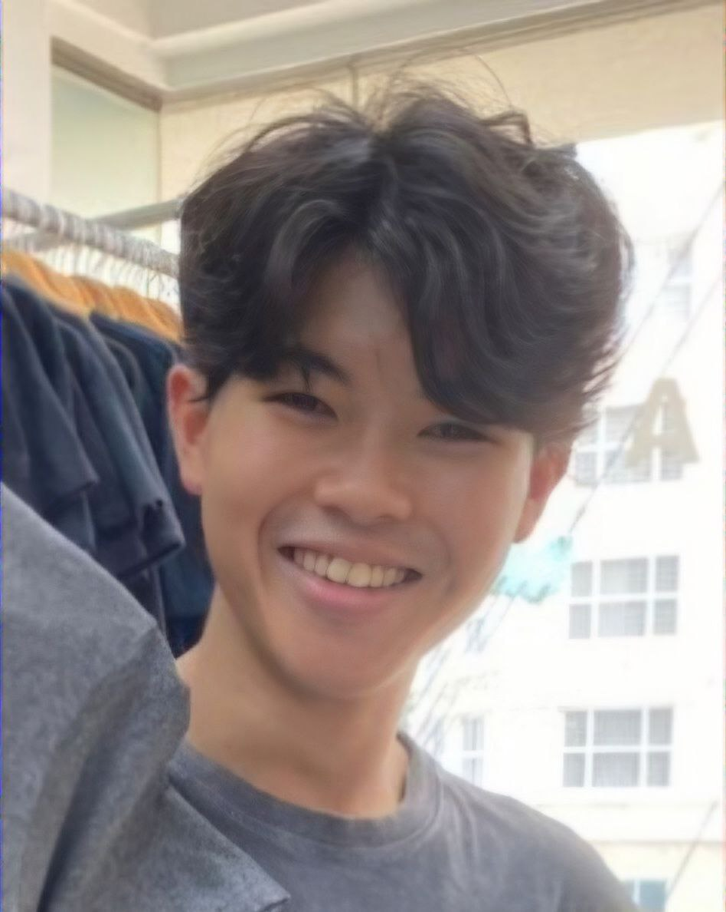
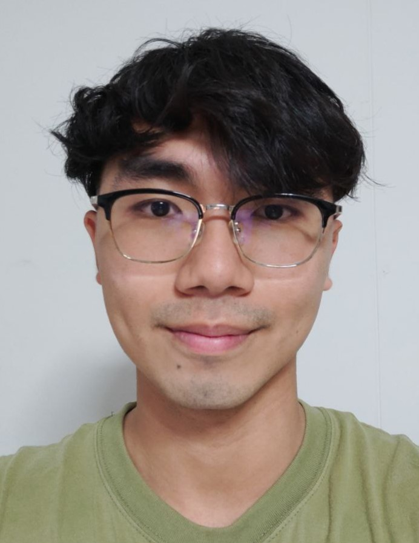
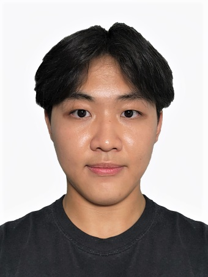
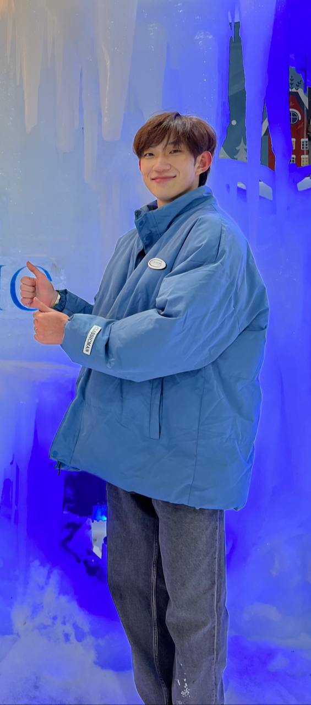
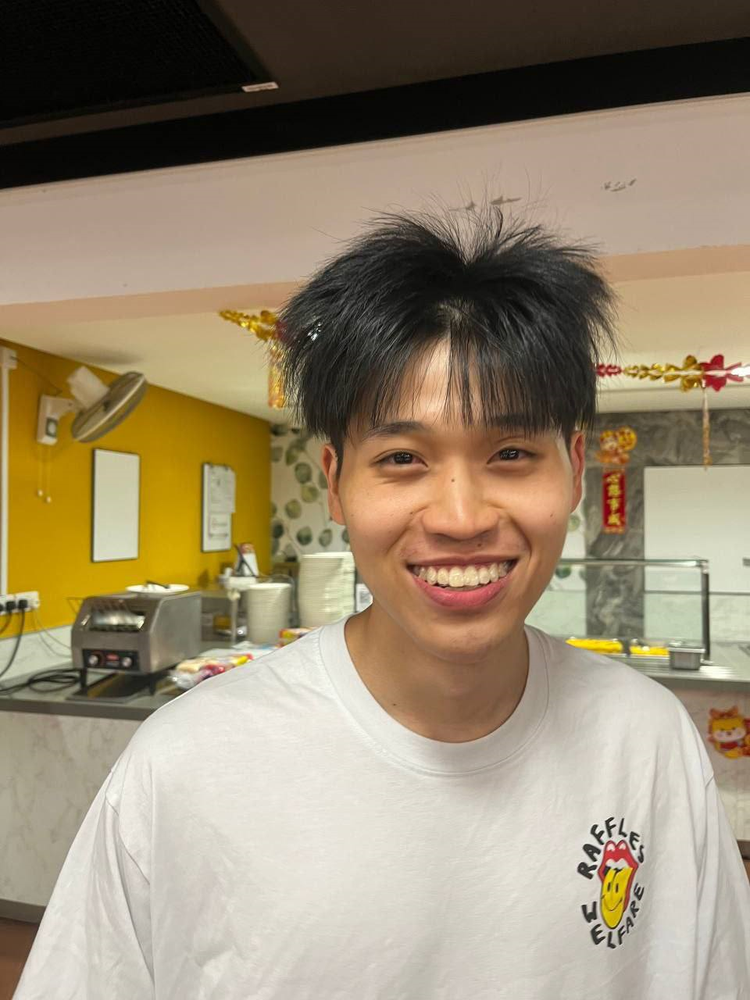

# About Us

We are a team based in the [School of Computing, National University of Singapore](http://www.comp.nus.edu.sg).

You can reach us at the email `seer[at]comp.nus.edu.sg`

## Project team

### Darryl Shuck

[[homepage](http://www.comp.nus.edu.sg/~damithch)]
[[github](https://github.com/shuckycheese)]
[[portfolio](team/shuckycheese)]

* Role: Developer
* Responsibilities: Code Quality, In charge of better search

### Poh Jing Choon

[[github](http://github.com/choonzies)]
[[portfolio](team/choonzies.md)]

* Role: Developer
* Responsibilities: Storage management

### Clarence

[[github](http://github.com/clarud)] 
[[portfolio](team/clarud.md)]

* Role: Developer, Deliverables and deadlines
* Responsibilities: Ensure project deliverables are done on time and in the right format, In charge of delete feature

### Daron Oh

[[github](http://github.com/daronoh)]
[[portfolio](team/daronoh.md)]

* Role: Developer
* Responsibilities: Integration, In charge of Search feature

### Nicholas Lam

[[github](http://github.com/niclammm)]
[[portfolio](team/niclammm.md)]

* Role: Scheduling and tracking
* Responsibilities: In charge of defining, assigning, and tracking project tasks.
