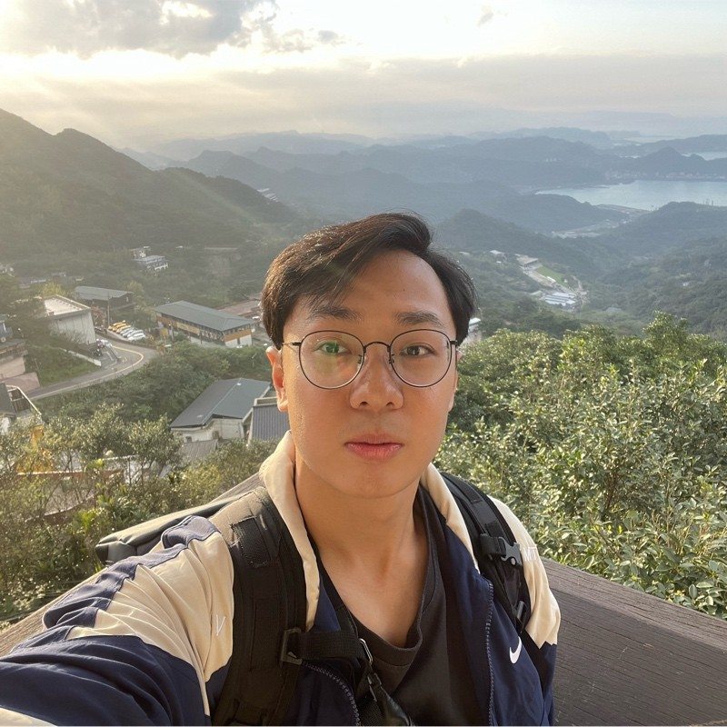

# About Us

We are a team based in the [School of Computing, National University of Singapore](http://www.comp.nus.edu.sg).

You can reach us at the email `seer[at]comp.nus.edu.sg`

## Project team

### Seah Minlong

[[github](https://github.com/seah-minlong)]
[[portfolio](team/seah-minlong.md)]

* Role: Developer
* Responsibilities: 
  * Scheduling & tracking
  * In charge of `Logic`

### Xan Ng

[[github](http://github.com/voldiemort)]
[[portfolio](team/voldiemort.md)]

* Role: Team Lead
* Responsibilities: Commons

### Chua Chong Sun

[[homepage](https://adventusfrontend-chongsun2002s-projects.vercel.app/)]
[[github](https://github.com/chongsun2002)]
[[portfolio](team/chongsun2002.md)]

* Role: Developer
* Responsibility: Code quality and Integration
  In charge of storage

### Justin Yeo

[[github](http://github.com/Justin-Yeo)] 
[[portfolio](team/justinyeo.md)]

* Role: Developer
* Responsibilities:
  * Deliverables and Deadlines
  * In charge of 'Ui'

### Zhanzhi Lou

[[github](http://github.com/zzzlou)]
[[portfolio](team/zzzlou.md)]

* Role: Developer
* Responsibilities: Documentation and in charge of Model
