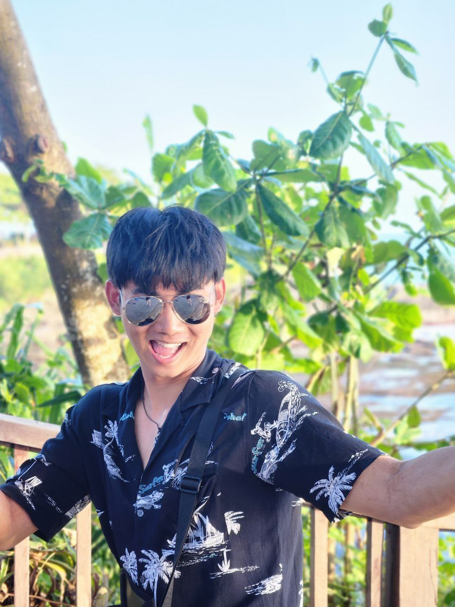
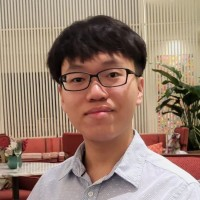
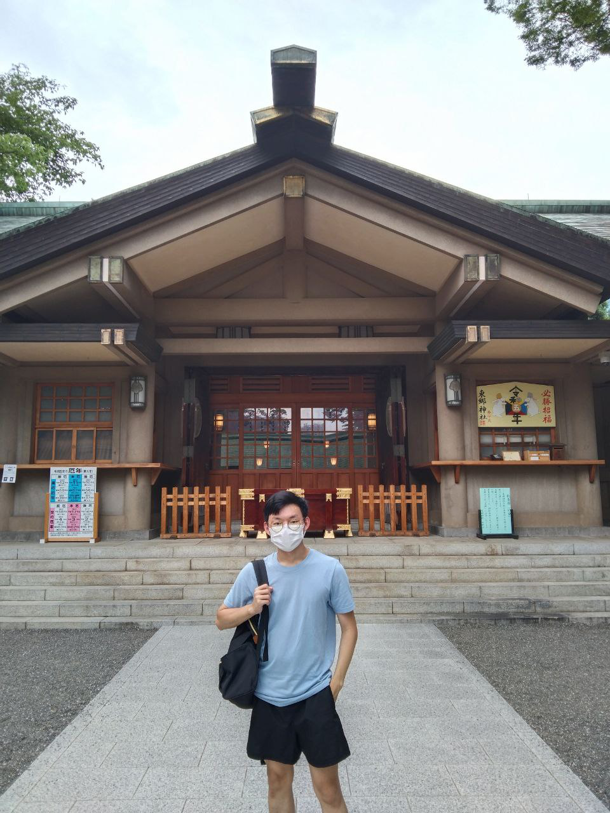

# About Us

We are a team based in the [School of Computing, National University of Singapore](http://www.comp.nus.edu.sg).

You can reach us at the email `seer[at]comp.nus.edu.sg`

## Project team

### John Doe

[[homepage](http://www.comp.nus.edu.sg/~damithch)]
[[github](https://github.com/)]
[[portfolio](team/johndoe.md)]

* Role: Project Advisor

### Anthony Goh

[[github](http://github.com/antgyf)]

* Role: Code Quality

### Wu Bojin

[[github](http://github.com/wubojin)]
[[portfolio](team/johndoe.md)]

* Role: Developer
* Responsibilities: Data

### Jayden Kim

[[github](https://github.com/Jayden-Kim-NUS)]
[[portfolio](team/johndoe.md)]

Hi, I like writing and formatting stuff (real).
* Role: Developer
* Responsibilities: Documentation

### Kieran Koh

[[github](http://github.com/FriedCabbageSalad)]
[[portfolio](team/johndoe.md)]  
I am Kieran, a Year 2 Computer Science student at the National University of Singapore!
My hobbies are Gaming and I've recently been experimenting with Home-Labs.
* Role: Developer
* Responsibilities: Testing
