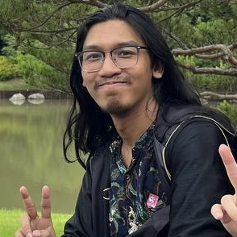
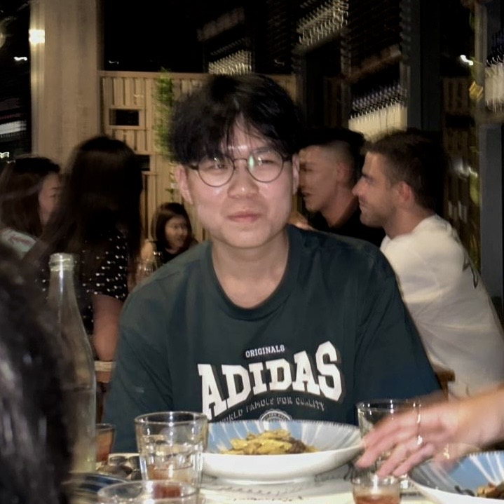
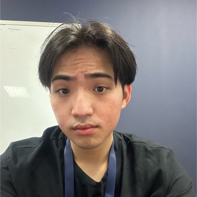
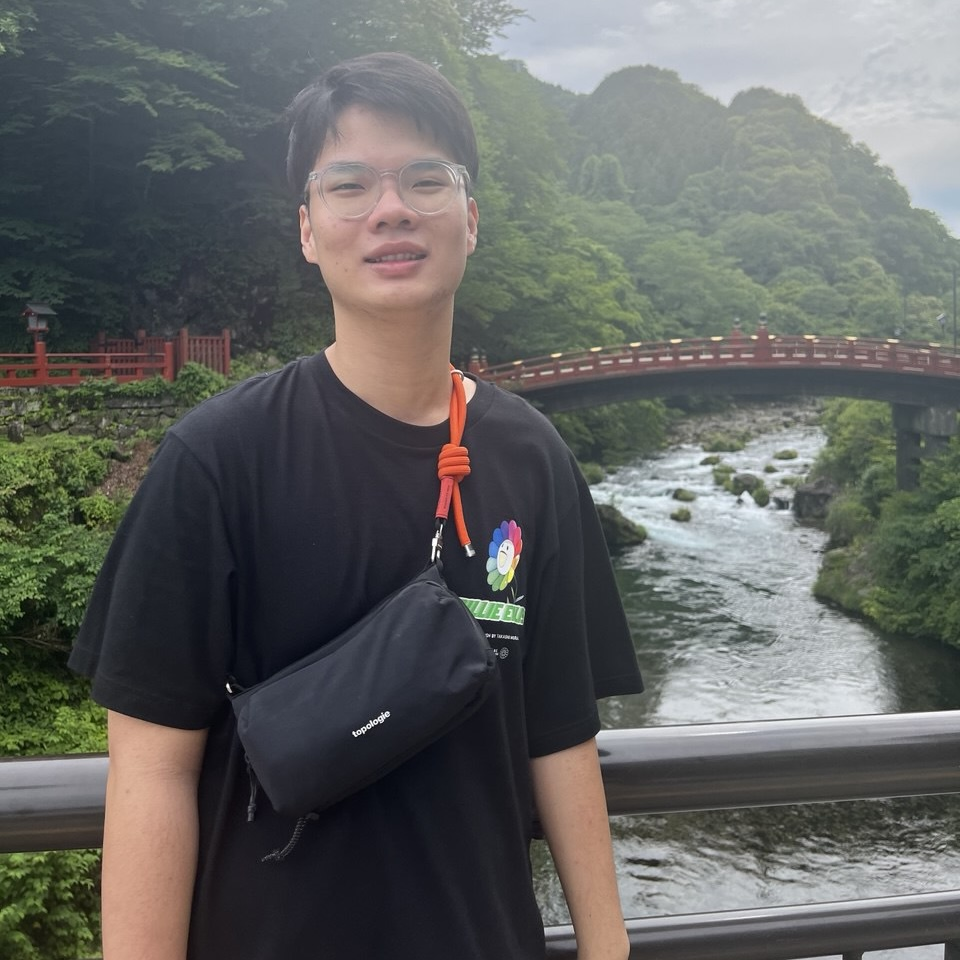
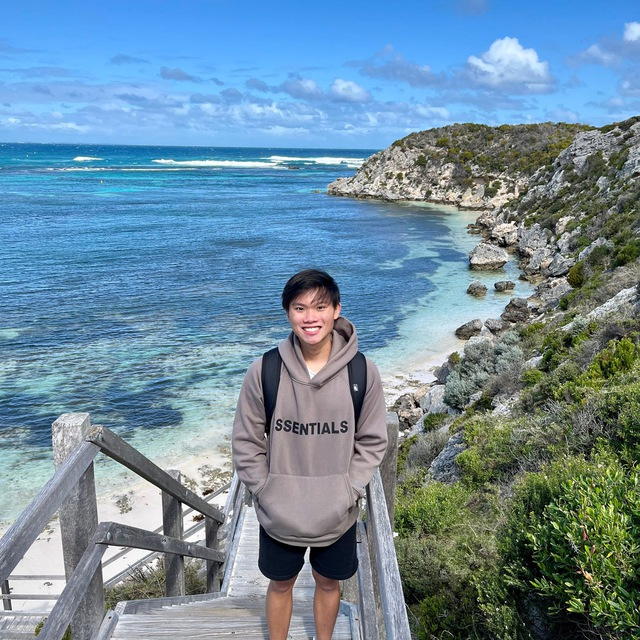

# About Us

We are a team based in the [School of Computing, National University of Singapore](http://www.comp.nus.edu.sg).

You can reach us at the email `seer[at]comp.nus.edu.sg`

## Project team

### Mohammad Tahir Bin Hairul

[[homepage](http://www.comp.nus.edu.sg/~damithch)]
[[github](https://github.com/meowloid)]
[[portfolio](team/tahirhairul)]

* Role: Project Advisor

### Han Yu

[[github](http://github.com/xhamyo)]
[[portfolio](team/xhamyo.md)]

* Role: Team Lead
* Responsibilities: UI

### Caleb Ng

[[github](http://github.com/calebyyy)] [[portfolio](team/calebng.md)]

* Role: Developer
* Responsibilities: Data

### Yu Quan

[[github](http://github.com/limyuquan)]
[[portfolio](team/limyuquan.md)]

* Role: Developer
* Responsibilities: Dev Ops + Threading

### Sean Wong

[[github](http://github.com/seanwong2)]
[[portfolio](team/seanwong2.md)]

* Role: Developer
* Responsibilities: UI
