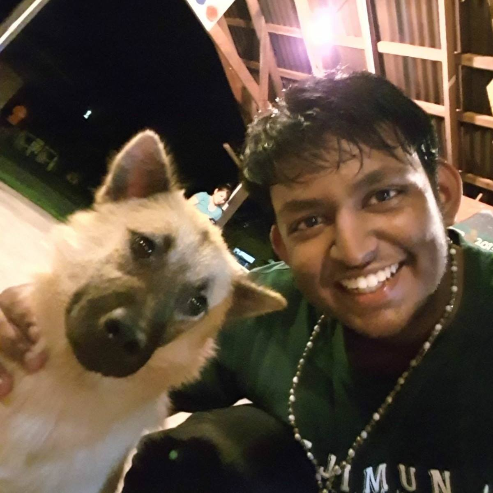

We are a team based in the [School of Computing, National University of Singapore](https://www.comp.nus.edu.sg).

You can reach us at the email `seer[at]comp.nus.edu.sg`

## Project team

### Yap Yong Zhuo

[[github](http://github.com/yong-zhuo)]
[[portfolio](team/yong-zhuo.md)]

* Role: Team Lead
* Responsibilities: UI/UX design and Commands
* About Me: I am a Year 2 Computer Science student minoring in Psychology.

### Sivakumar Karthikraj

[[github](http://github.com/TechRaj)]
[[portfolio](team/TechRaj.md)]

* Role: Developer
* Responsibilities: Backend
* About me: I am a Year 2 Computer Science student who has in interest in SWE and AI/ML. When I am not coding, you can usually catch me cycling across Singapore or listen to some Rap.

### Ho Wei Nian

[[github](http://github.com/hweinian)]
[[portfolio](team/hweinian.md)]

* Role: Developer
* Responsibilities: Backend
* About me: I am a Year 2 Computer Science student who has in interest in SWE. 

###  Yukna

[[github](http://github.com/yadobler)]
[[portfolio](team/yadobler.md)]

* Role: Developer
* Responsibilities: Anything and Everything
