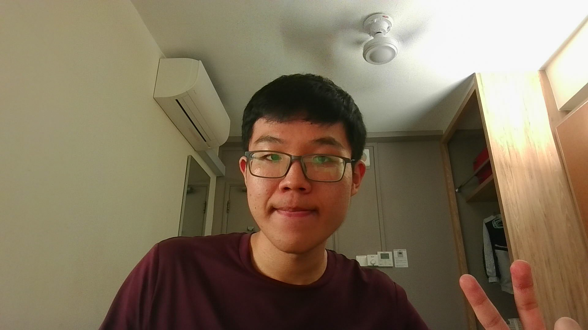
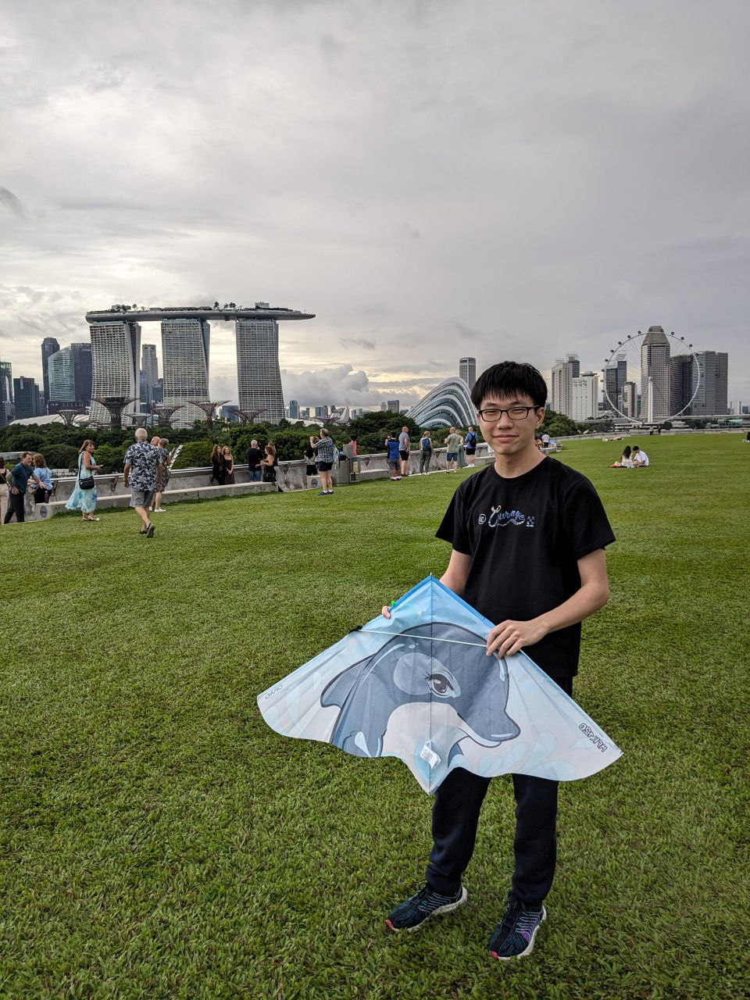
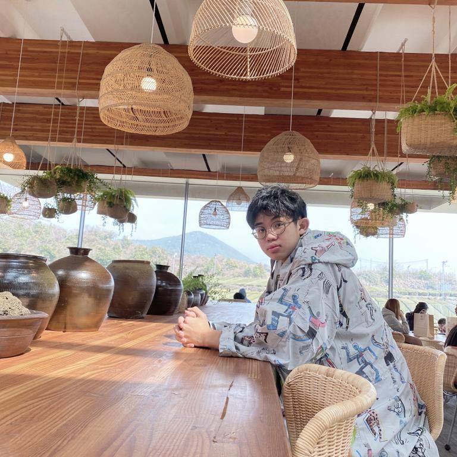

<!--
---
layout: default.md
title: "About Us"
---
-->

# About Us

We are a team based in the [School of Computing, National University of Singapore](http://www.comp.nus.edu.sg).

You can reach us at the email seer[at]comp.nus.edu.sg

## Project team

### Qin Haichen

[[github](https://github.com/QinHaichen12)]
[[portfolio](team/qinhaichen12.md)]

- Role: Developer
- Responsibilities: Data, UI

### Yuvraj Aryan Singh

[[github](http://github.com/yuvrajaryan)]
[[portfolio](team/yuvrajaryan.md)]

- Role: Developer
- Responsibilities: Data, UI

### Daniel Lai

[[github](http://github.com/starchypotatocode)]
[[portfolio](team/starchypotatocode.md)]

- Role: Developer
- Responsibilities: Testing, Integration

### Keith Ong

[[github](http://github.com/keithxun)]
[[portfolio](team/keithxun.md)]

- Role: Developer
- Responsibilities: UI

### Tag Han

[[github](https://github.com/taggyhan)]
[[portfolio](team/taggyhan.md)]

- Role: Developer
- Responsibilities: UI, Scheduling and tracking
