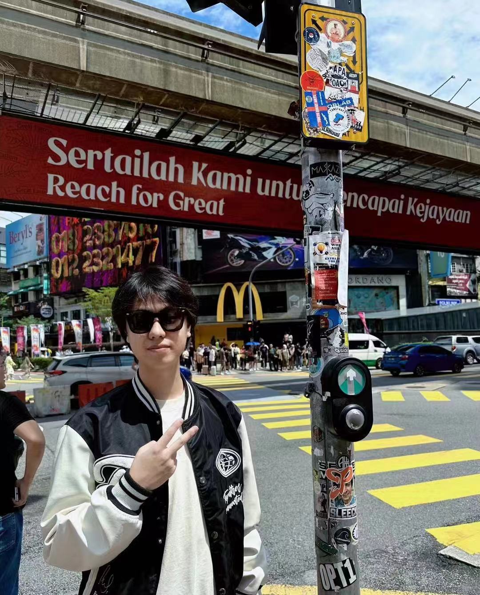

We are a team based in the [School of Computing, National University of Singapore](https://www.comp.nus.edu.sg).

You can reach us at the email `seer[at]comp.nus.edu.sg`

## Project team

### Yao Kexiang

[[github](http://github.com/publicmain)]
[[portfolio](team/johndoe.md)]

* Role: Team Lead
* Responsibilities: UI

### Jane Doe

[[github](http://github.com/johndoe)]
[[portfolio](team/johndoe.md)]

* Role: Team Lead
* Responsibilities: UI

### Yao Hejun

[[github](http://github.com/testing1234567891011121314)] [[portfolio](team/johndoe.md)]

* Role: In charge of code quality
* Responsibilities: Responsible for quality of code

### Jean Doe

[[github](http://github.com/johndoe)]
[[portfolio](team/johndoe.md)]

* Role: Developer
* Responsibilities: Dev Ops + Threading

### Jalen Lee Rui Xian

[[github](http://github.com/jalenleeruixian)]
[[portfolio](AY2425S1-CS2103T-T16-1/jalenleeruixian.md)]

* Role: In charge of documentation
* Responsibilities: Responsible for the quality of various project documents.
