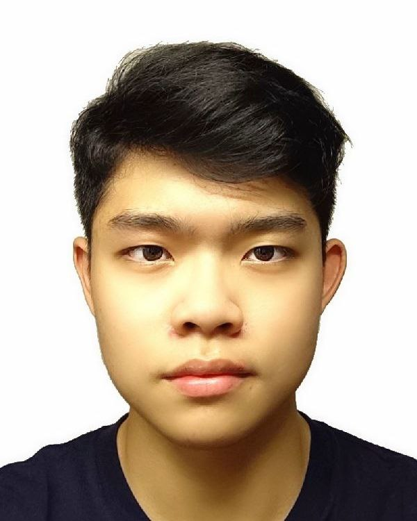
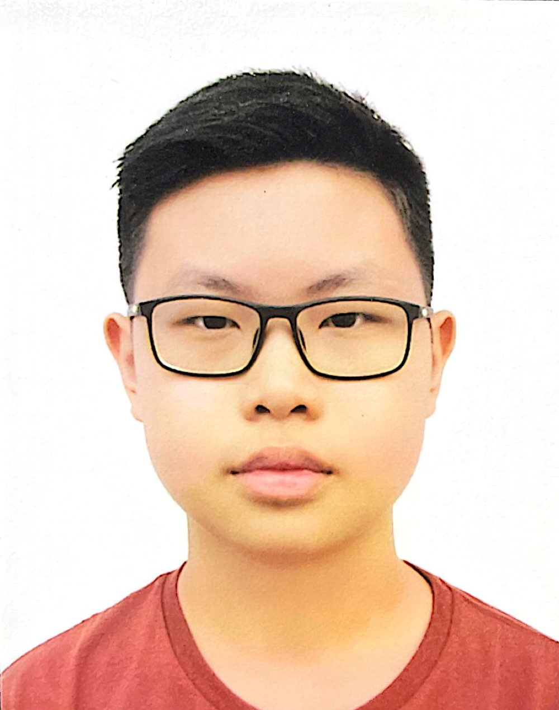
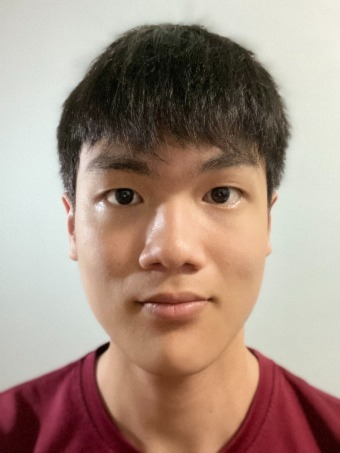

# About Us

We are a team based in the [School of Computing, National University of Singapore](http://www.comp.nus.edu.sg).

You can reach us at the email `seer[at]comp.nus.edu.sg`

## Project team
### Chua Wee Kiat Nicholas

[[github](https://github.com/nicholasCWK)]
[[portfolio](team/nicholascwk.md)]

* Role: Integration

### Haixin

[[homepage](http://www.comp.nus.edu.sg/~damithch)]
[[github](https://github.com/LiHaixin000)]
[[portfolio](team/lihaixin000.md)]

* Role: Code Quality

### Nicholas Koh

[[github](https://github.com/Nicholaskoh1)]
[[portfolio](team/nicholaskoh1.md)]

* Role: Scheduling and Tracking

### Lim Yixiang

[[github](https://github.com/limyixiang)]
[[portfolio](team/limyixiang.md)]

* Role: Testing

### Jean Doe

[[github](http://github.com/johndoe)]
[[portfolio](team/johndoe.md)]

* Role: Developer
* Responsibilities: Dev Ops + Threading

### James Doe

[[github](http://github.com/johndoe)]
[[portfolio](team/johndoe.md)]

* Role: Developer
* Responsibilities: UI
