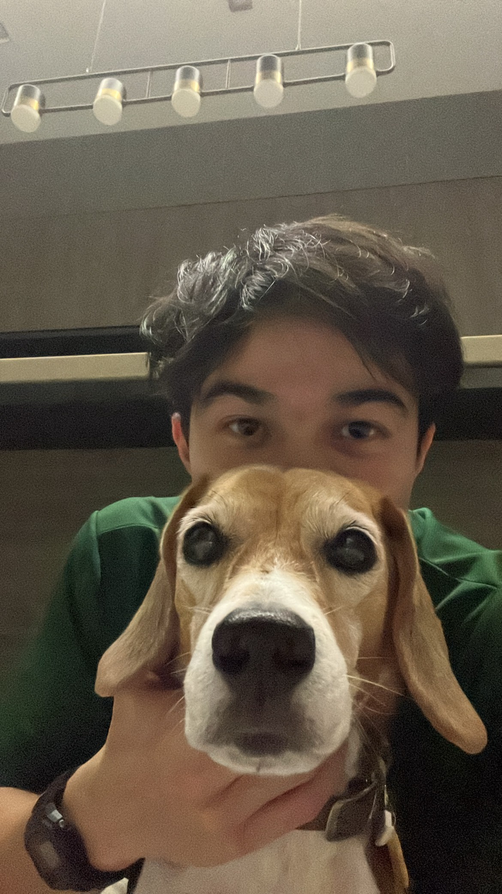
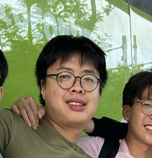
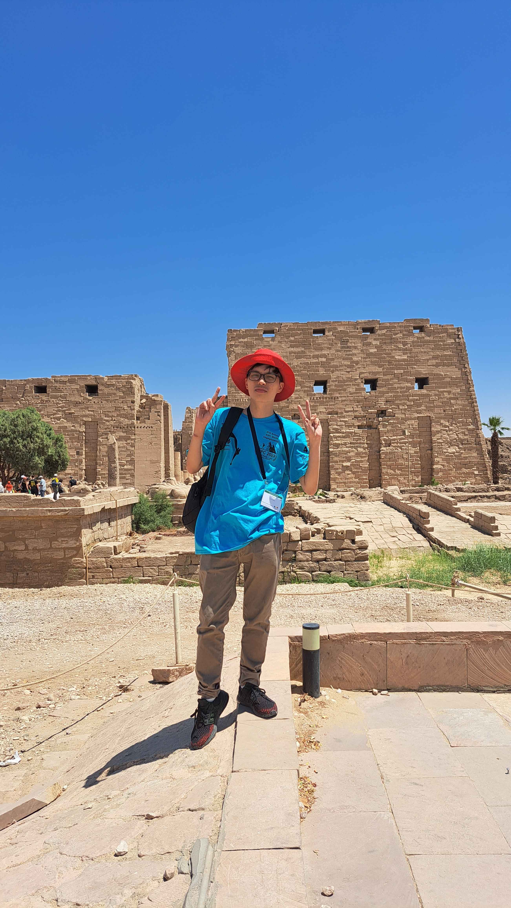

We are a team based in the [School of Computing, National University of Singapore](https://www.comp.nus.edu.sg).

You can reach us at the email `seer[at]comp.nus.edu.sg`

## Project team

### Hoo Yu Shing

[[github](https://github.com/hooyushing)]
[[portfolio](https://www.linkedin.com/in/hoo-yu-shing-252a08238/)]

* Role: Team Lead
* Responsibilities: Responsible for overall project coordination.

### Wong Wai Hin

[[github](http://github.com/waihin26)]
[[portfolio](https://www.linkedin.com/in/wai-hin-wong-6875ab110/)]

* Role: Deliverables and Deadline
* Responsibilities: Ensure project deliverables are done on time and in the right format.

### Matthew Ho

[[github](http://github.com/sumomomomomo)]
[[portfolio](https://www.linkedin.com/in/matthew-ho-803a41192/)]

* Role: Code Quality
* Responsibilities: Looks after code quality; ensures adherence to coding standards.

### Munhui Kim

[[github](http://github.com/munhuikim)]
[[portfolio](https://www.linkedin.com/in/munhui-kim/)]

* Role: Documentation
* Responsibilities: Responsible for the quality of various project documents.

### Vu Hoang Kien

[[github](http://github.com/kienvumrpm)]
[[portfolio](https://www.linkedin.com/in/kienvu2211/)]

* Role: Implementor
* Responsibilities: Help others to debug.
