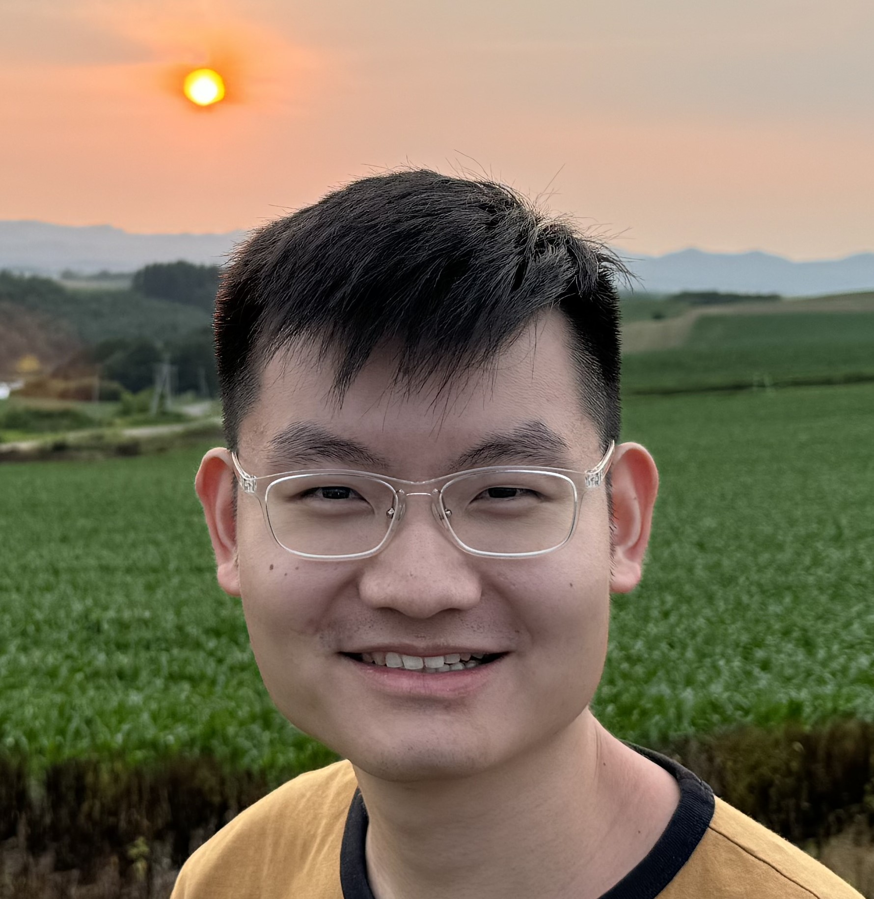
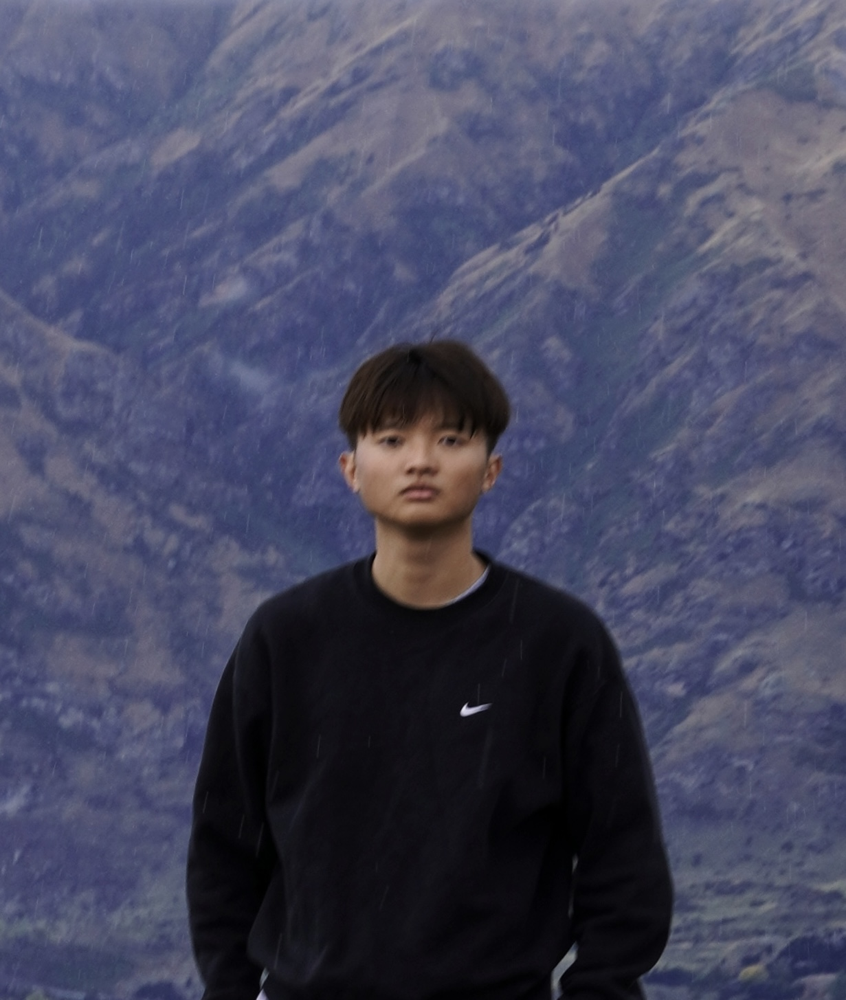
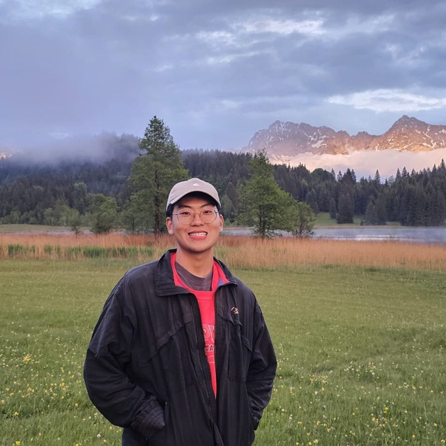
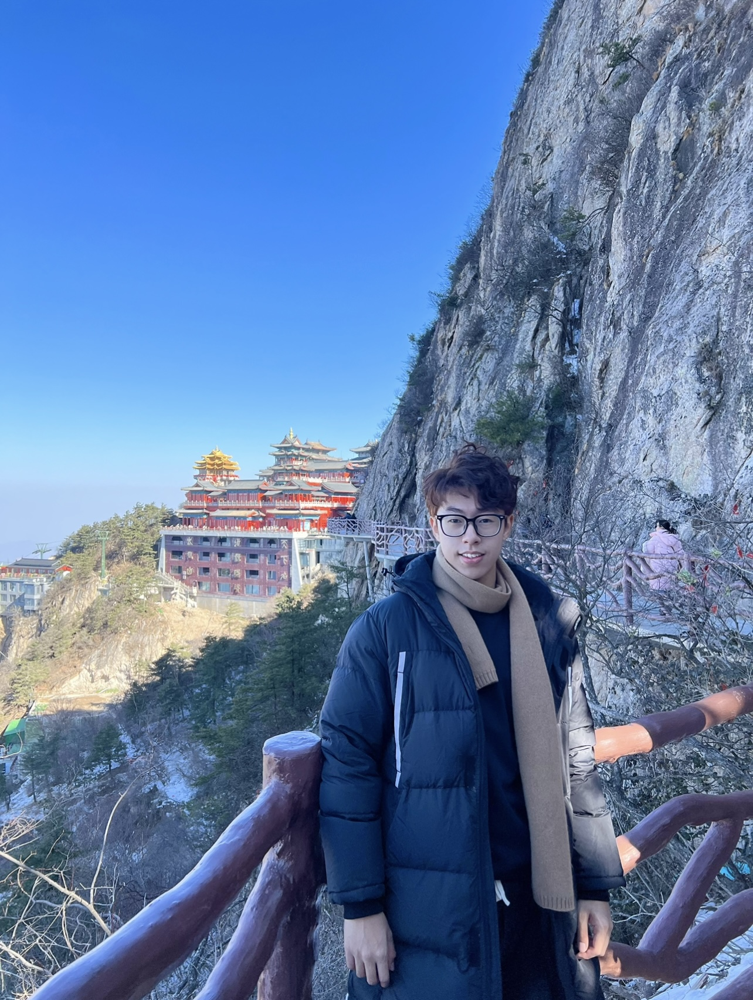
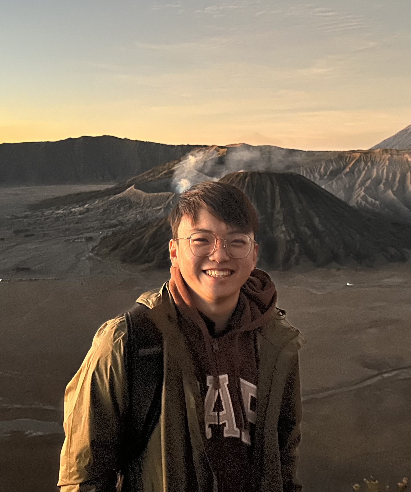

We are a team based in the [School of Computing, National University of Singapore](https://www.comp.nus.edu.sg).

You can reach us at the email `seer[at]comp.nus.edu.sg`

## Project team
### Caleb Chong

[[github](http://github.com/calebchongsj)]
[[profile](members/calebchong.md)]

I am analytical and detail oriented. With my attention to detail, I feel I can spot any
mistake that may not align with the standard code practice.

* Role: Code Quality by ensuring that the code adheres to the standard in CS2103T
* Responsibilities: Storage, Logic and Main

### Ryan Lim

[[github](https://github.com/ryenl)]
[[portfolio](team/johndoe.md)]

* Role: Testing

### Lucas Sam

[[github](http://github.com/yikyak02)]
[[portfolio](./members/lucas.md)]

* Role: Project Advisor
### Qiao Bowen

[[github](http://github.com/bbryant824)] [[portfolio](team/bowen.md)]

* Role: Developer
* Responsibilities: UI

### Samuel Then Shi Jie

[[github](http://github.com/samuelthen)]
[[portfolio](members/samuelthen.md)]

* Role: Developer
* Responsibilities: Backend
