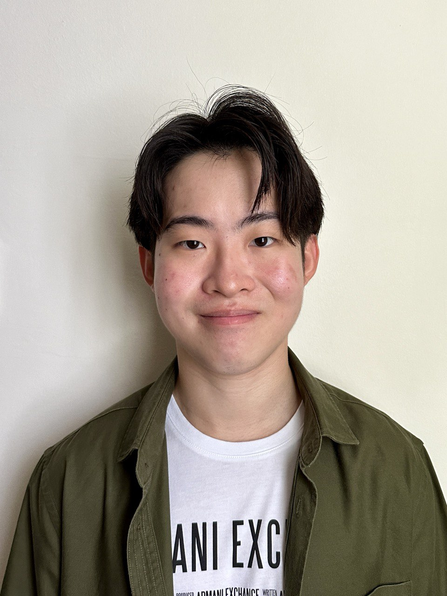
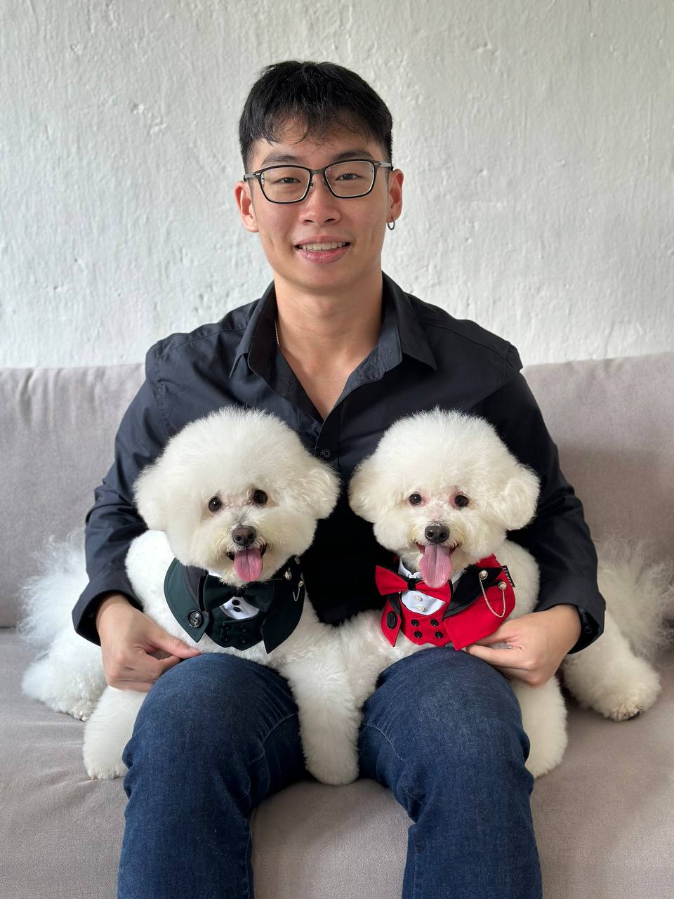
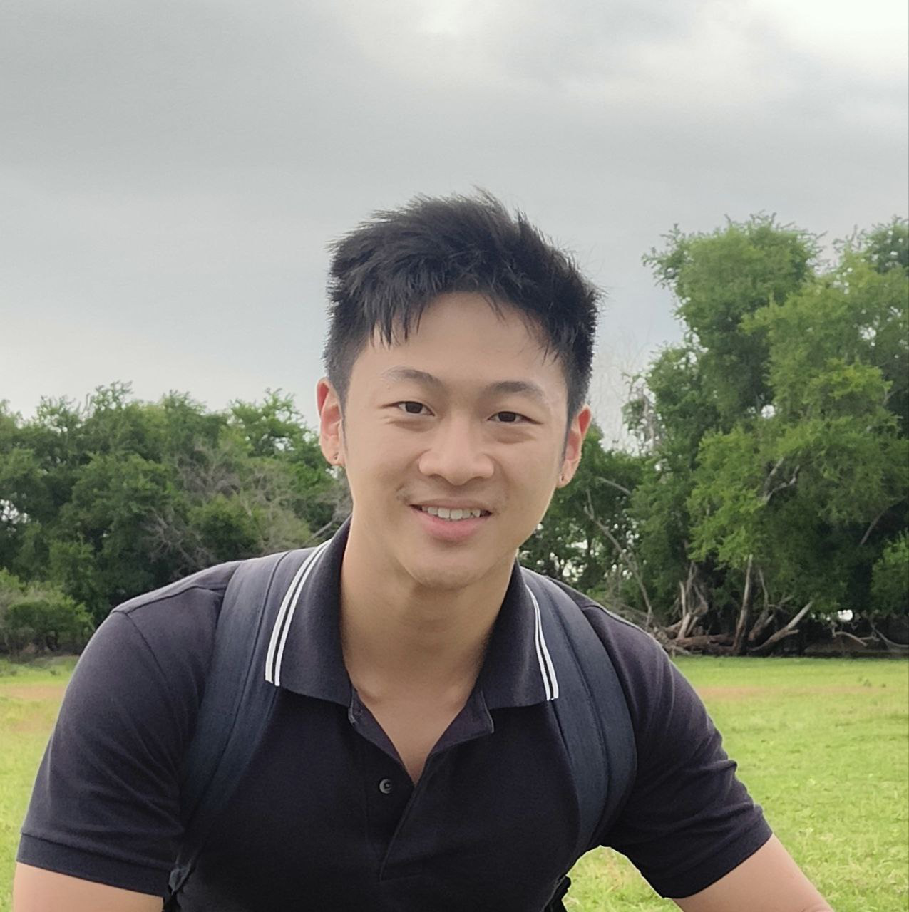

We are a team based in the [School of Computing, National University of Singapore](https://www.comp.nus.edu.sg). 
Our aim is to create human friendly products that improve the productivity of everyday jobs. An example is our recent product, PROperty, a state of the art Address Book tailored to the intricate and fast pace needs of property agents 

You can reach us at the email `e1113201@u.nus.edu`

## Project team

### Bing Heng

[[homepage](http://www.comp.nus.edu.sg/~damithch)]
[[github](https://github.com/BuffWuff1712)]
[[portfolio](team/johndoe.md)]

* Role: Developer

### Dylan Chan

[[github](https://github.com/vatinius)]

* Role: Developer

### Tay Xuen Ye

[[github](http://github.com/tayxuenye)]
[[portfolio](team/tayxuenye.md)]

* Role: Developer
* Responsibilities: Data

### Teo Kai Xiang

[[github](http://github.com/tkaixiang)]
[[portfolio](team/johndoe.md)]

* Role: Developer
* Responsibilities: Full-Stack (Frontend + Backend)

### Zhang Yao

[[github](http://github.com/sayomaki)]
[[portfolio](team/johndoe.md)]

* Role: Developer
* Responsibilities: UI & Dev Ops
