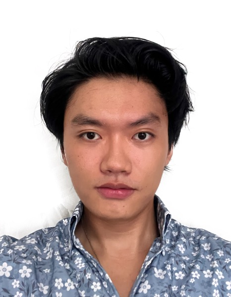

We are a team based in the [School of Computing, National University of Singapore](https://www.comp.nus.edu.sg).

You can reach us at the email `seer[at]comp.nus.edu.sg`

## Project team

### Dominic

[[homepage](https://github.com/dominic2412)]
[[github](https://github.com/dominic2412)]
[[portfolio](team/johndoe.md)]

*
- Rank: ***** General (5 star General)
- Role: Lead developer & Chief of UserGuide
- Responsibilities: lead the team, oversee the User guide

### Jane Doe

[[github](http://github.com/johndoe)]
[[portfolio](team/johndoe.md)]

* Role: Team Lead
* Responsibilities: UI

### Stanley Tang Zhiheng

[[github](http://github.com/stanleytangzh)] [[portfolio](team/stanleytang.md)]

* Role: Developer
* Responsibilities: to be added soon

### Jean Doe

[[github](http://github.com/johndoe)]
[[portfolio](team/johndoe.md)]

* Role: Developer
* Responsibilities: Dev Ops + Threading

### James Doe

[[github](http://github.com/johndoe)]
[[portfolio](team/johndoe.md)]

* Role: Developer
* Responsibilities: UI

