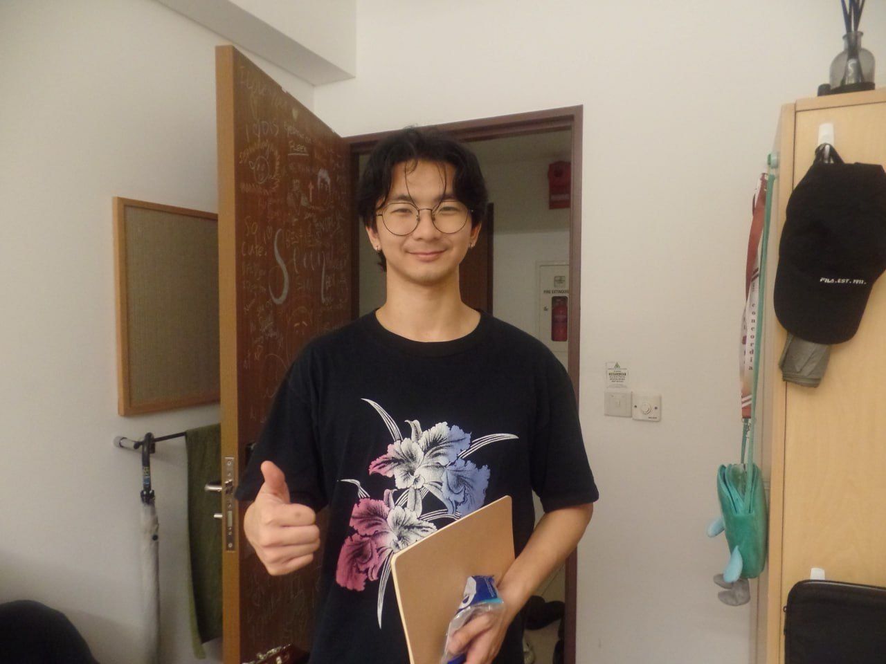
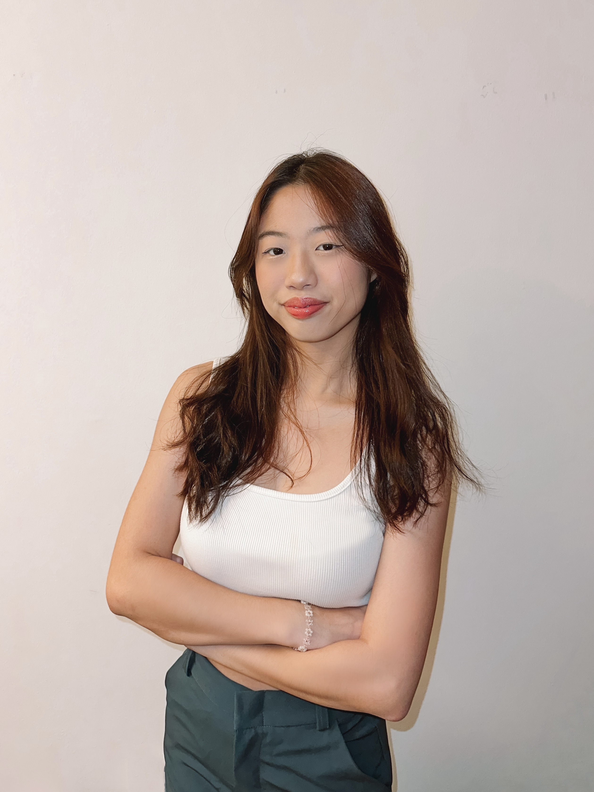
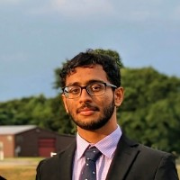
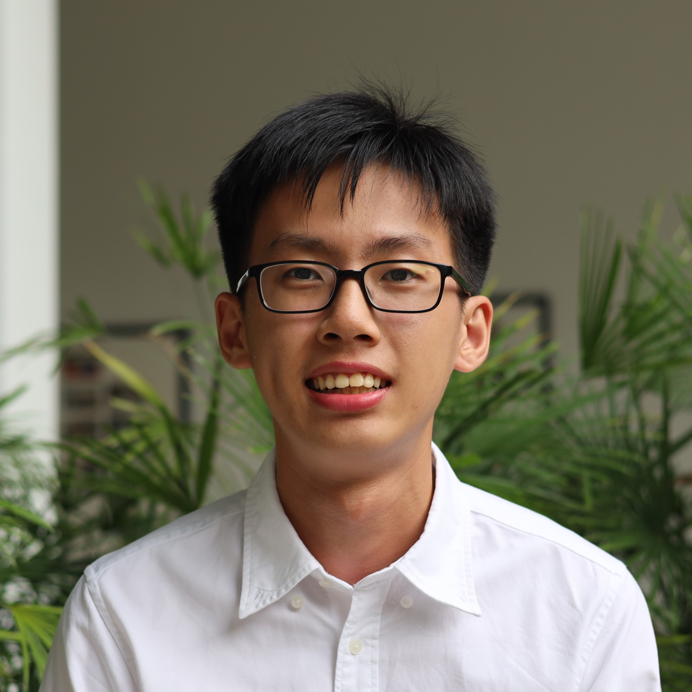

We are a team based in the [School of Computing, National University of Singapore](https://www.comp.nus.edu.sg).

You can reach us at the email `seer[at]comp.nus.edu.sg`

## Project team

### Alden Tan

[[github](https://github.com/aldentantan)]

* Role: Team Lead
* Responsibilities: Deliverables and Deadlines, Scheduling and Tracking

### Kelly Wang Sze Qing

[[github](https://github.com/kellywsq03)]

* Role: Developer
* Responsibilities: Testing & Code Quality

### Saajid Shaik

[[github](http://github.com/saajidshaik02)] <!--[[portfolio](team/johndoe.md)]-->

* Role: Developer
* Responsibilities: Documentation, SourceView Expert

### Wong Zhian John

<!-- [[homepage](http://www.comp.nus.edu.sg/~damithch)] -->
[[github](http://github.com/johnwz123)]
<!-- [[portfolio](team/johndoe.md)] -->

* Role: Developer
* Responsibilities: Integration + Code Quality

