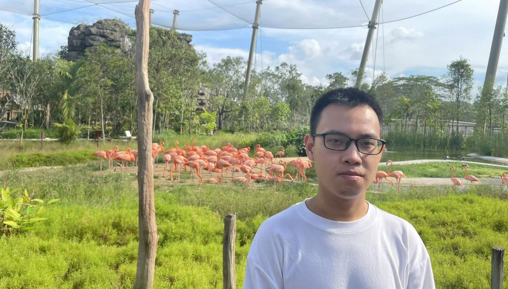
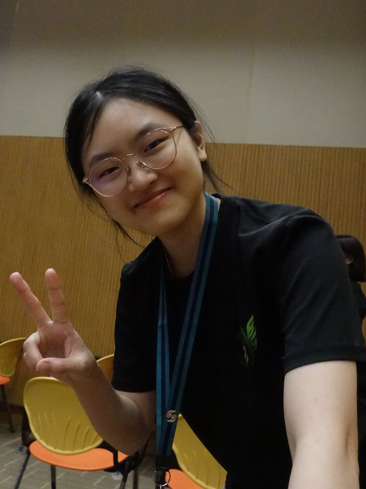
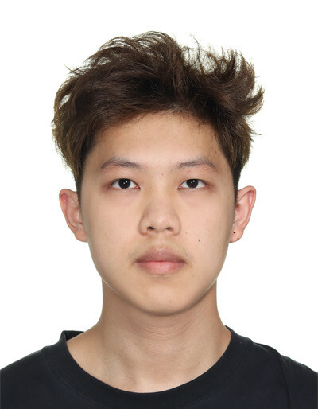
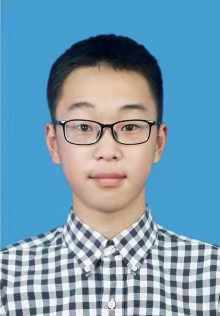

# About Us

We are a team based in the [School of Computing, National University of Singapore](http://www.comp.nus.edu.sg).

You can reach us at the email `seer[at]comp.nus.edu.sg`

## Project team

### Mao Xiongkai

[[github](https://github.com/MAOXIONGKAI)]
[[portfolio](team/maoxiongkai.md)]

* Role: Team Lead
* Responsibilities: code quality, weekly meetings
* In charge of the module role components

### Eline Ngu Xiang Ee

[[github](https://github.com/elinengu)]
[[portfolio](team/elinengu.md)]

* Role: Developer
* In charge of UI and storage

### Huang Jiaxi

[[github](https://github.com/huangjiaxi1111)]
[[portfolio](team/huangjiaxi1111.md)]

* Role: Developer
* In charge of module role search and user guide

### Zhu Tianyi

[[github](http://github.com/lithops-zty)]
[[portfolio](team/lithops-zty.md)]

* Role: Deputy Team Lead, Developer
* Responsibilities: deadlines, deliverables
* In charge of data persistence and module role modification

### Tan Wei Seng

[[github](http://github.com/weiseng18)]
[[portfolio](team/weiseng18.md)]

* Role: Developer, Git expert
* Responsibilities: model, testing, code quality
* In charge of code quality and progress tracking
