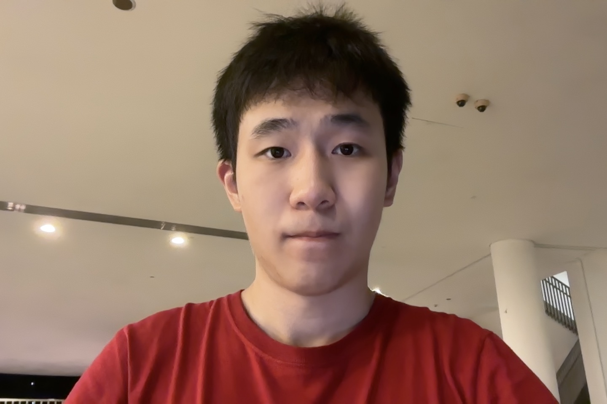
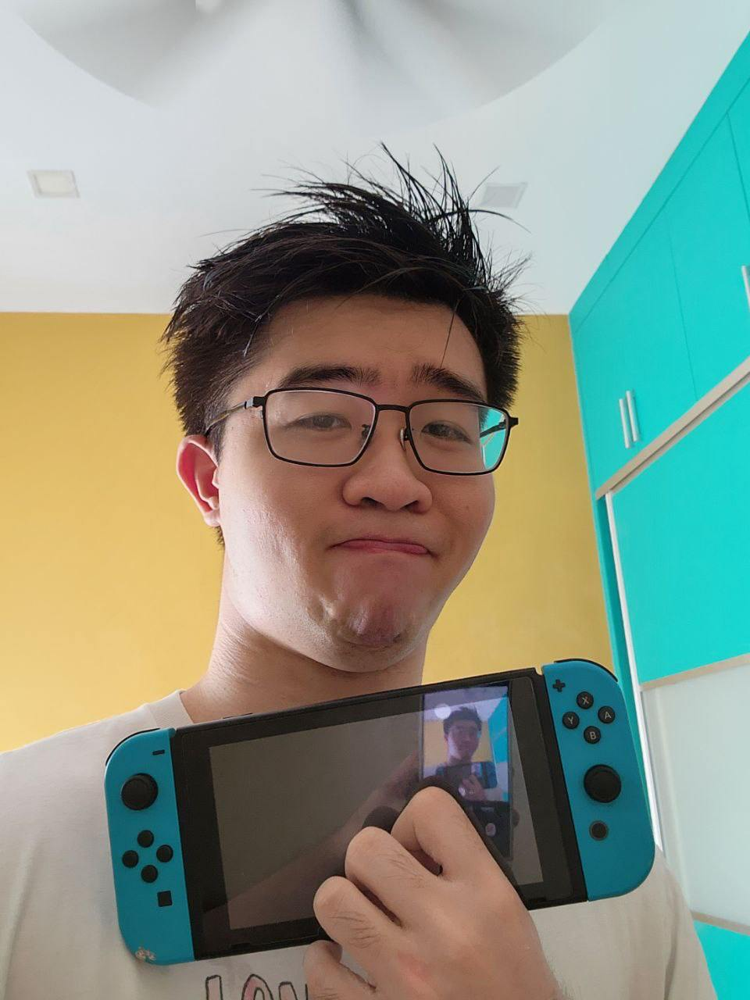
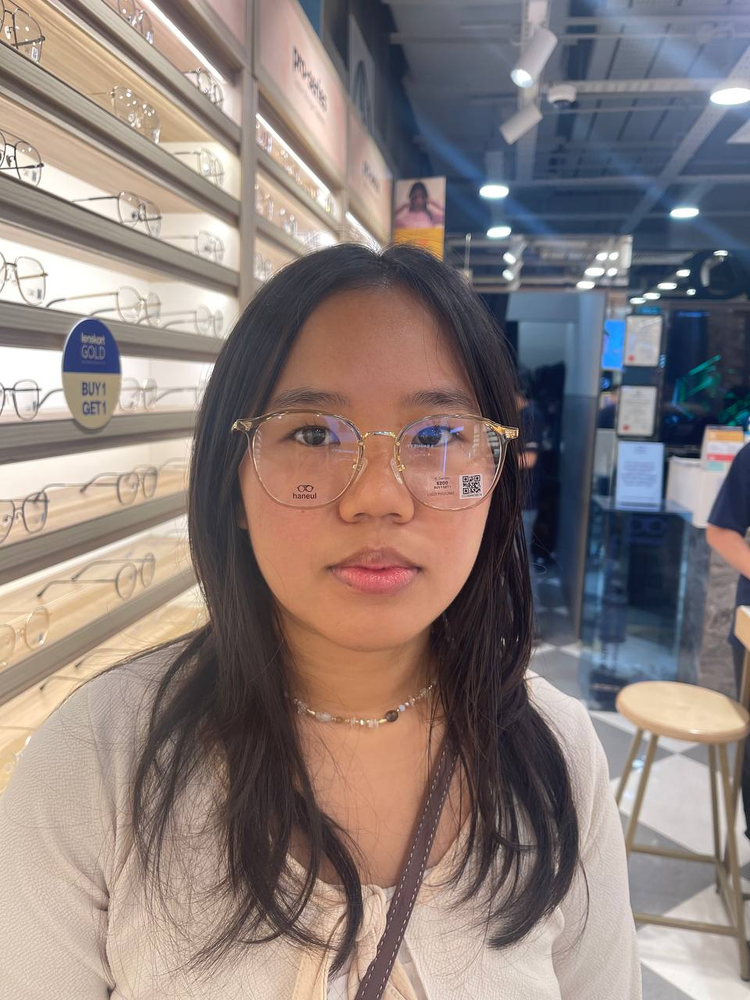

# About Us

We are a team based in the [School of Computing, National University of Singapore](http://www.comp.nus.edu.sg).

You can reach us at the email `seer[at]comp.nus.edu.sg`

## Project team

### John Doe

[[homepage](http://www.comp.nus.edu.sg/~damithch)]
[[github](https://github.com/johndoe)]
[[portfolio](team/johndoe.md)]

* Role: Project Advisor

### He Shi

[[github](http://github.com/lancehaha)]

* Role: Developer
* Responsibilities: non-functional requirements

### Sean Foong

[[github](http://github.com/SeanFoongjt)] [[portfolio](team/johndoe.md)]

* Role: Developer
* Responsibilities: Documentation, Data

### Jean Doe

[[github](http://github.com/johndoe)]
[[portfolio](team/johndoe.md)]

* Role: Developer
* Responsibilities: Dev Ops + Threading

### Chooi Shao Xian

[[github](http://github.com/chashaobao123)]

* Role: Developer
* Responsibilities: UI
