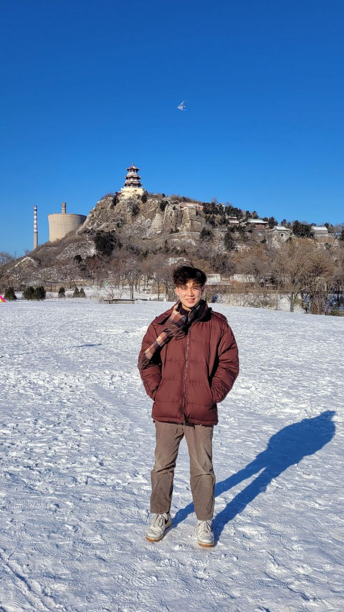
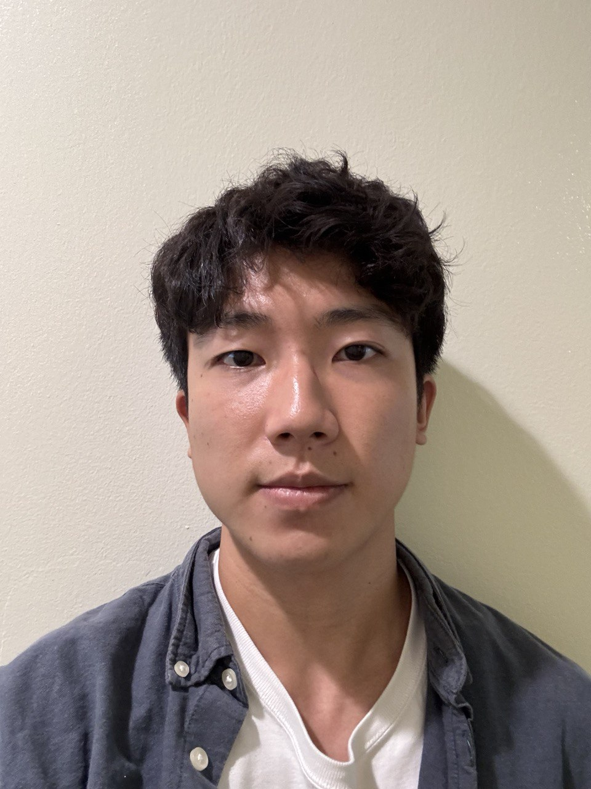

We are a team based in the [School of Computing, National University of Singapore](https://www.comp.nus.edu.sg).

You can reach us at the email `seer[at]comp.nus.edu.sg`

## Project team

### He Minhao

[[homepage](http://www.comp.nus.edu.sg/~damithch)]
[[github](https://github.com/minhao23)]
[[portfolio](team/johndoe.md)]

* Role: Project Advisor

### Wang Xiyu (Wxy2003-xy)

[[github](http://github.com/wxy2003-xy)]
[[portfolio](team/johndoe.md)]

* Role: Team Lead
* Responsibilities: UI

### Sugimoto Shoujin

[[github](http://github.com/jinnsuke)] [[portfolio](https://www.linkedin.com/in/shoujinsugimoto/)]

* Role: Developer 
* Responsibilities: Data

### Raviraj Talgeri

[[github](http://github.com/johndoe)]
[[portfolio](team/johndoe.md)]

* Role: Developer 
* Responsibilities: Dev Ops + Threading