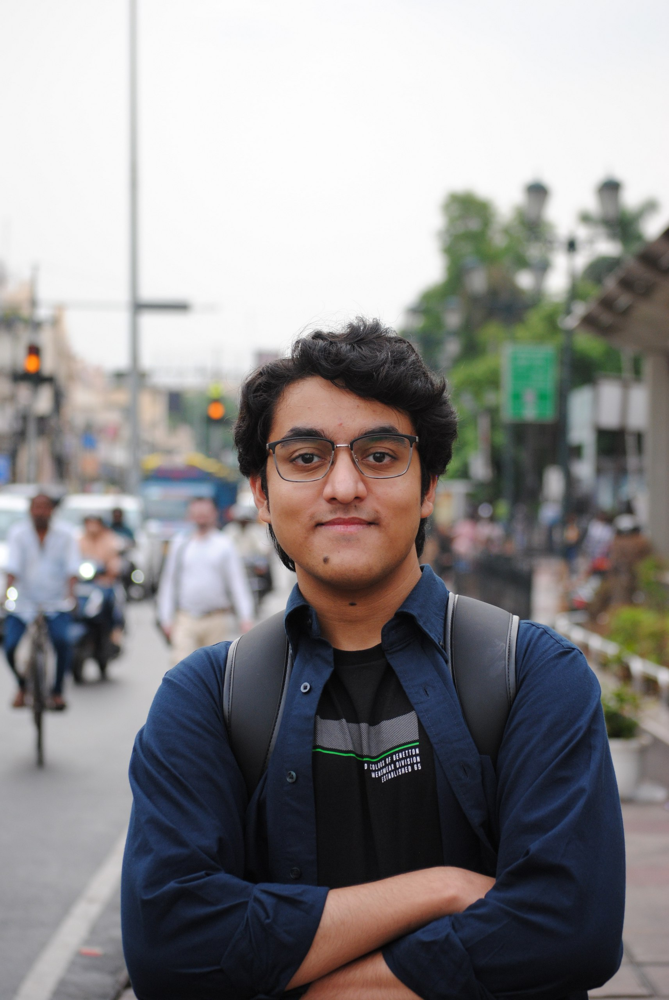
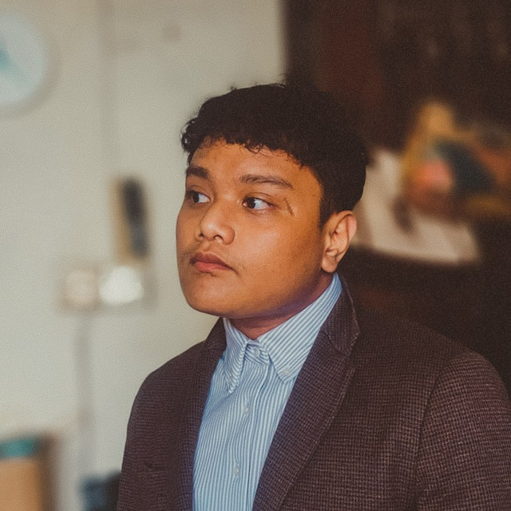
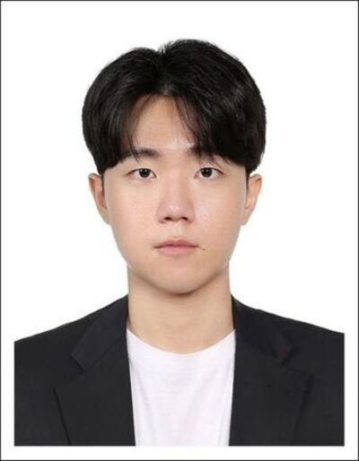
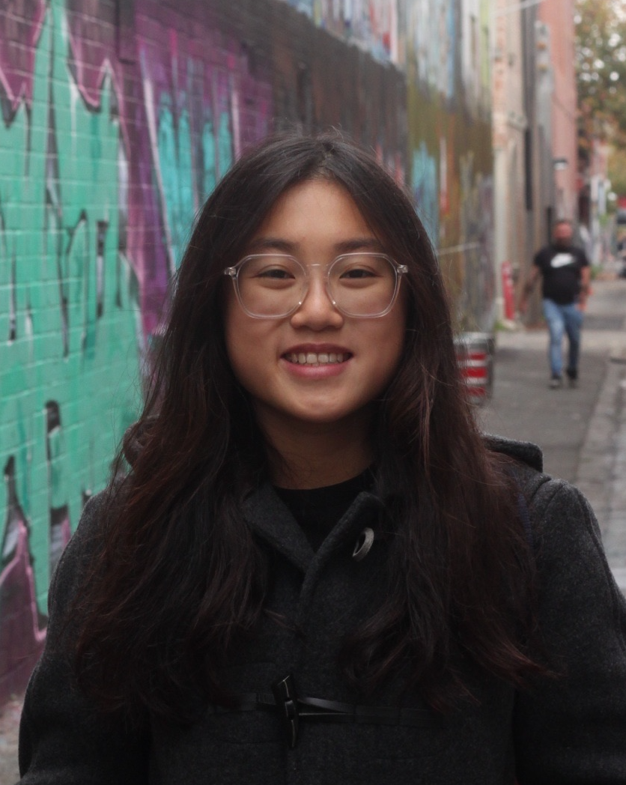
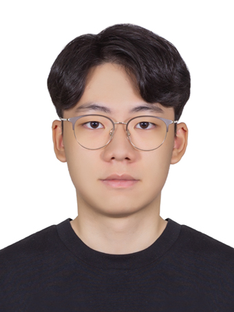

# About Us

We are a team based in the [School of Computing, National University of Singapore](http://www.comp.nus.edu.sg).

You can reach us at our individual emails below!

## Project team

### Vangmay Sachan

[[github](https://github.com/vangmay)] 
[[portfolio](team/vangmay.md)]

* Role: Developer and Quality Assurance
* Responsibilities: Logic

### Muhammad ZAIDAN bin Sani

[[github](https://github.com/zaidansani)]
[[email](mailto:zaidan@u.nus.edu)]
[[portfolio](team/zaidansani.md)]

* Role: Team Lead
  * Integration
  * In charge of `Model`

### Jae Choi

[[github](http://github.com/choiwab)] 
[[portfolio](https://jaechoi.vercel.app/)]

* Role: Code quality + In Charge of Storage 
* Responsibilities: Oversee code quality of tp and review Storage component

### Rachel Tai

[[github](https://github.com/rxchell)]
[[portfolio](team/rxchell.md)]

* Role: Documentation
* Responsibilities: Commons

### Jo An

[[github](https://github.com/jayjay19630)]
[[email](mailto:jo.an@u.nus.edu)]
[[portfolio](team/jayjay19630.md)]

* Role: Deliverables and Deadlines, Scheduling and Tracking
* Responsibilities: UI
