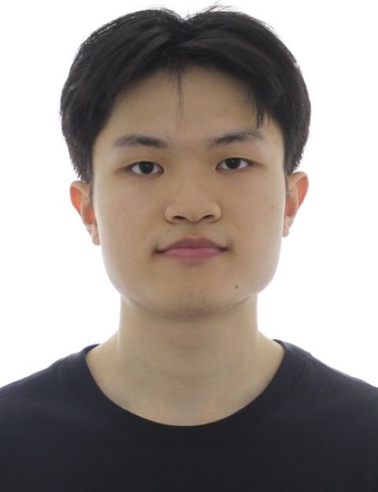
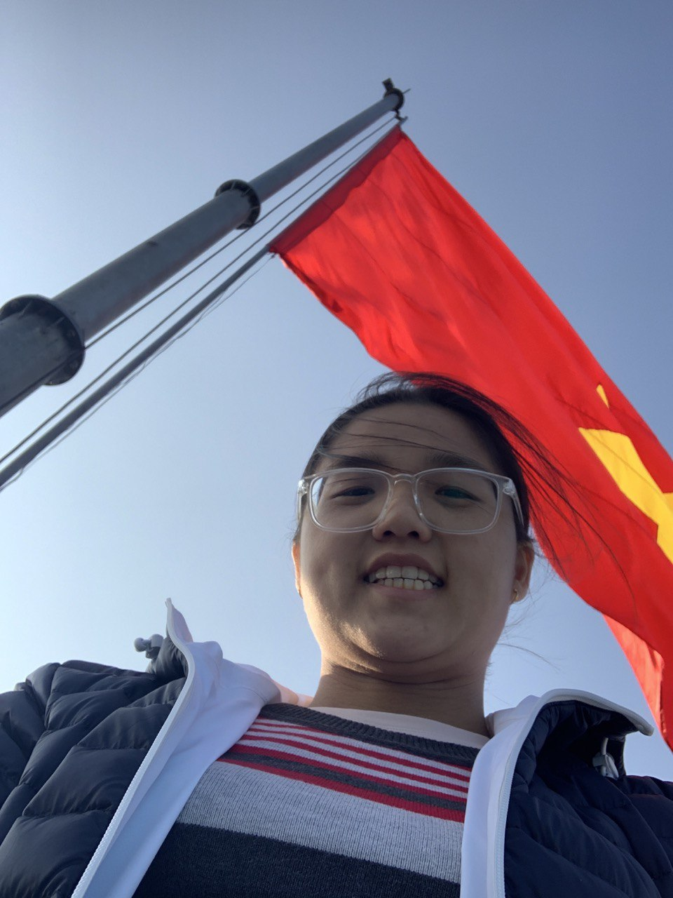
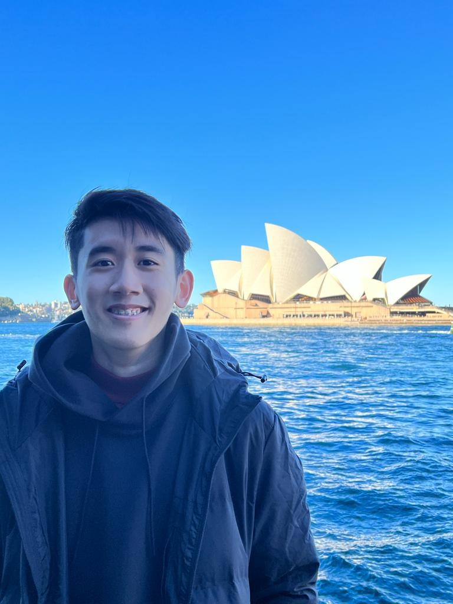
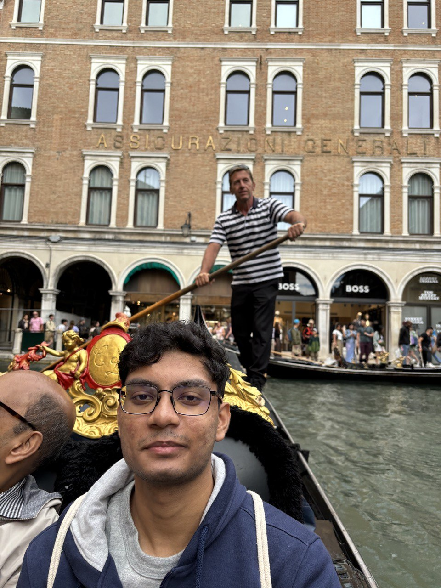
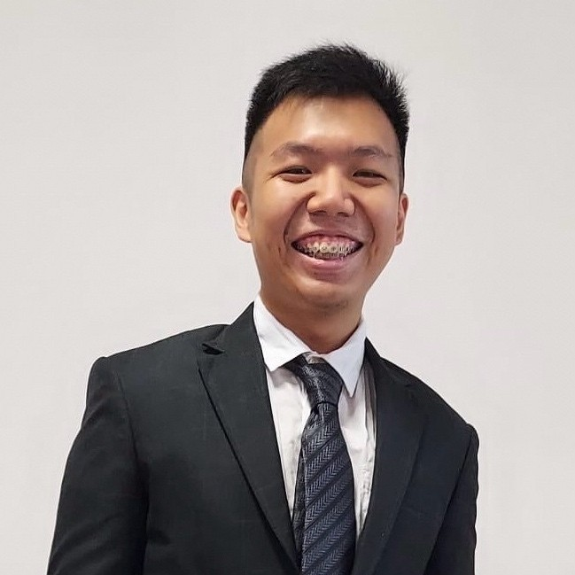

# About Us

We are a team based in the [School of Computing, National University of Singapore](http://www.comp.nus.edu.sg).

You can reach us at the email `seer[at]comp.nus.edu.sg`

## Project team

### Chen Feng

[[github](https://github.com/feng1231)]
[[portfolio](team/johndoe.md)]

* Role: Team Lead
* Responsibilities: Scheduling and tracking
* In charge of Logic package

### Dinh Duy Linh Dan

[[github](http://github.com/DennieDan)]
[[portfolio](team/johndoe.md)]

* Role: Testing
* Responsibilities: Model

### Timothy Tan

[[homepage](http://github.com/teamotitan)]
[[github](https://github.com/teamotitan)]
[[portfolio](team/johndoe.md)]

* Role: Documentation

### Soumyadip Saha

[[github](http://github.com/soumyadip-cmd)]
[[portfolio](team/johndoe.md)]

* Role: Developer, deadline and deliverables manager
* Responsibilities: commons

### Toh Yi Fan

[[github](https://github.com/TY1Fan)]
[[portfolio](team/johndoe.md)]

* Role: Code quality, and in charge of storage component
* Responsibilities: Looks after code quality and storage component

