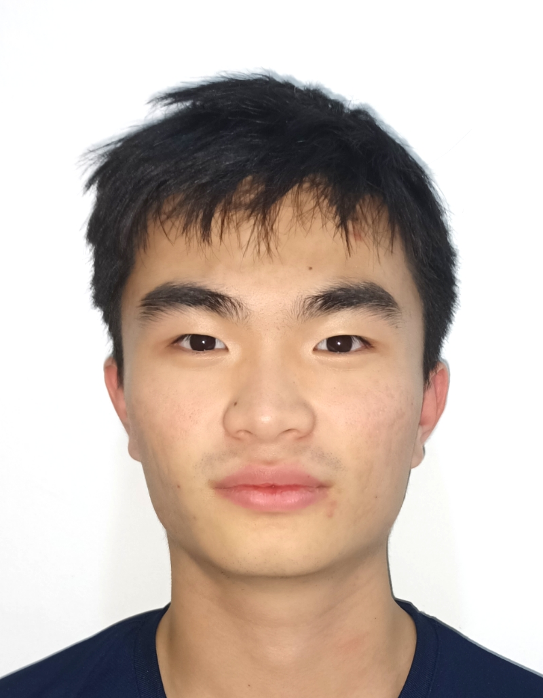
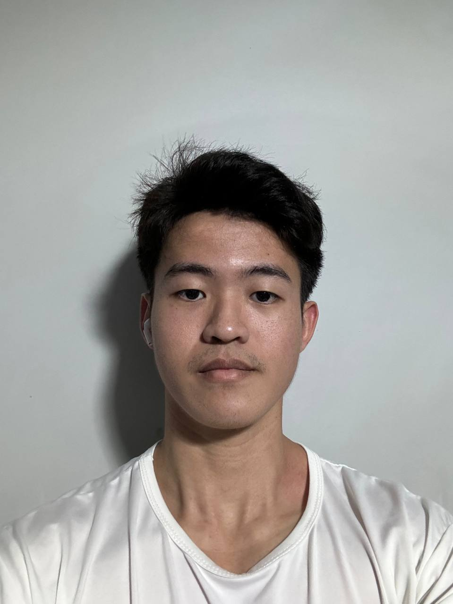
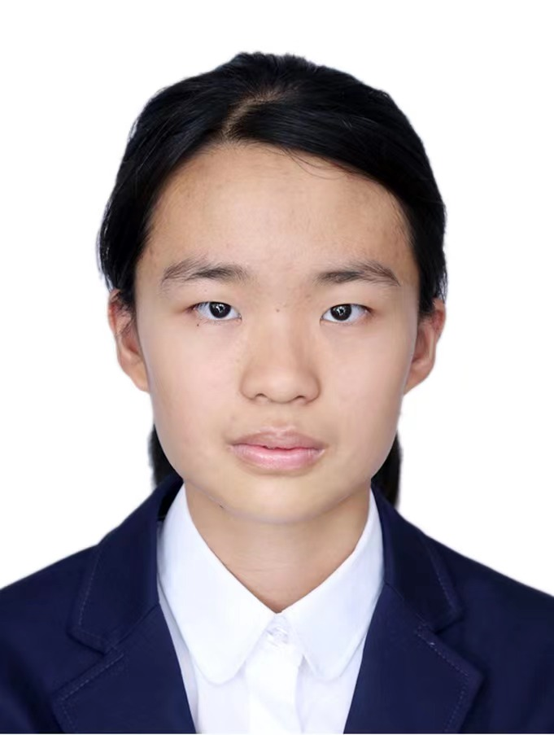

We are a team based in the [School of Computing, National University of Singapore](https://www.comp.nus.edu.sg).

You can reach us at the email `cs2103t_f11_2[at]comp.nus.edu.sg`

## Project team

### Caleb Ang

[[github](https://github.com/superb-sushi)]
[[portfolio](team/johndoe.md)]

* Role: Project Advisor

### Shi Ziyuan

[[github](http://github.com/shizy)]
[[portfolio](team/johndoe.md)]

* Role: Team Lead
* Responsibilities: UI

### Wei Lian

[[github](http://github.com/weiliann)] [[portfolio](team/johndoe.md)]

* Role: Developer
* Responsibilities: Data

### Cai Runxin

[[github](https://github.com/Rachelcoll)]
[[portfolio](team/johndoe.md)]

* Role: Developer
* Responsibilities: Dev Ops + Threading

### Yi Hao

[[github](http://github.com/yyihaoc)]
[[portfolio](team/johndoe.md)]

* Role: Developer
* Responsibilities: Code Quality, Integration
