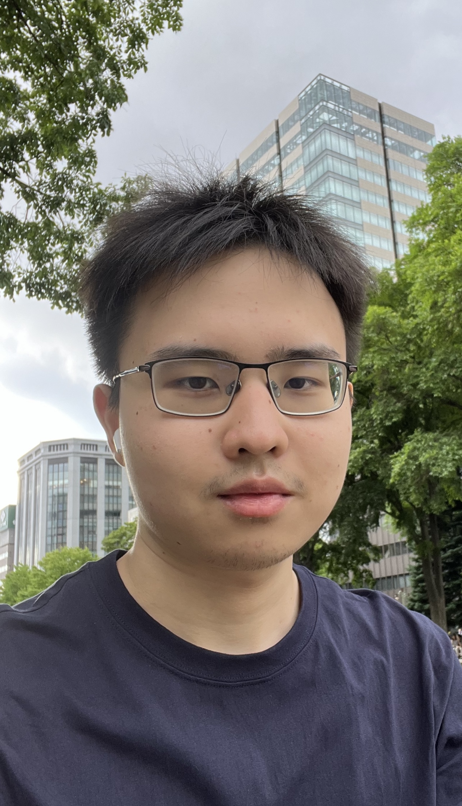
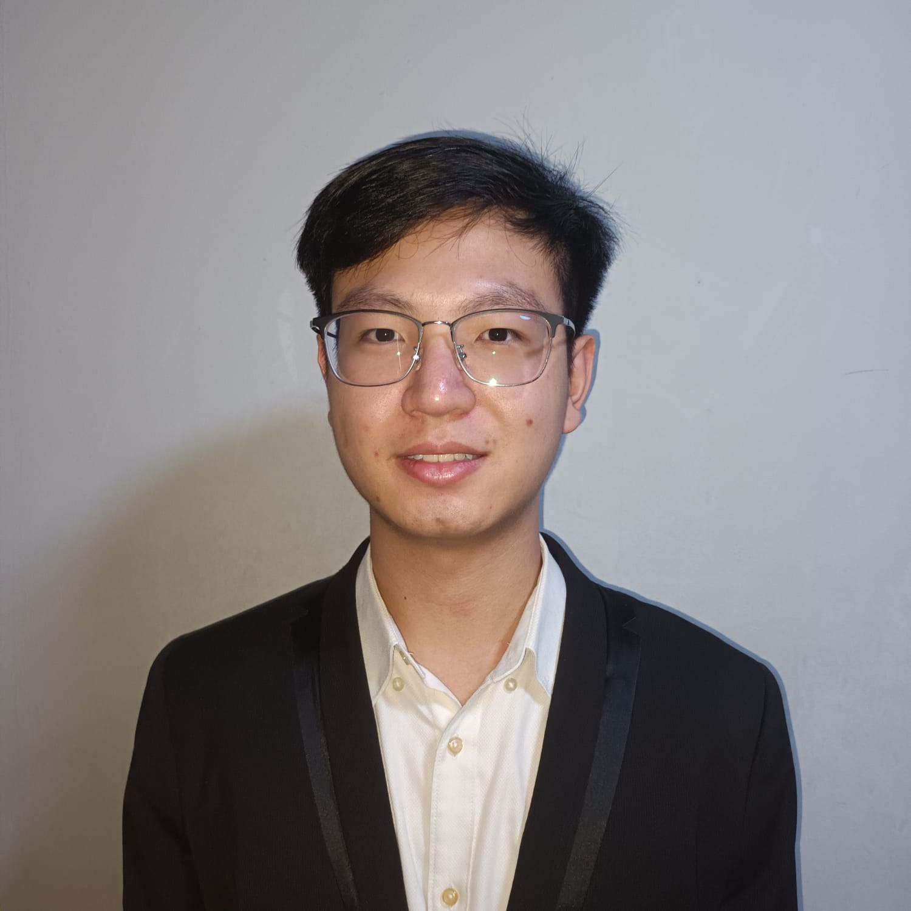

We are a team based in the [School of Computing, National University of Singapore](https://www.comp.nus.edu.sg).

You can reach us at the email `seer[at]comp.nus.edu.sg`

## Project team

### Nicholas Cheng De Fei

[[github](https://github.com/Nicholas-Cheng-De-Fei)]
[[linkedin](https://www.linkedin.com/in/nicholas-cheng-)]

- Role: Team Lead
- Responsibilities: Project Coordination, VScode Expert

### Joel Tio

[[website](https://joelt.io)]
[[github](https://github.com/joeltio)]
[[linkedin](https://www.linkedin.com/in/joel-tio)]

- Role: Developer
- Responsibilities: Code Quality, Git Expert

### Lim Jia Wei

[[github](https://github.com/ITLimJiaWei)]
[[linkedin](https://www.linkedin.com/in/jiawei88)]

- Role: Developer
- Responsibilities: Testing, IntelliJ Expert

### Kenneth Teo

[[github](https://github.com/KennethTeo2002)]
[[linkedin](https://www.linkedin.com/in/kenneth-teo-boon-jun)]

- Role: Developer
- Responsibilities: Integration, Deliverables and deadlines

### Sheen

[[github](https://github.com/sheenkerr)]
[[linkedin](https://www.linkedin.com/in/sheenkerr)]

- Role: Developer
- Responsibilities: Documentation
