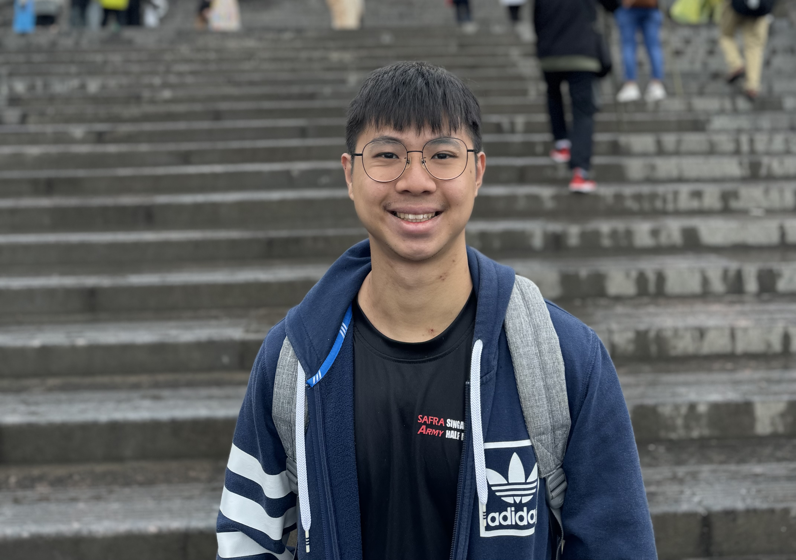
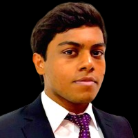
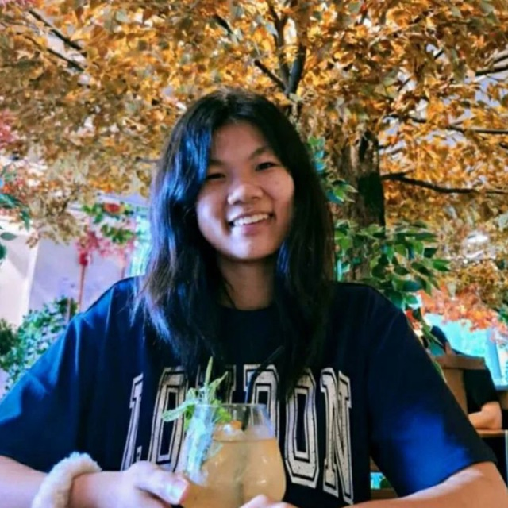
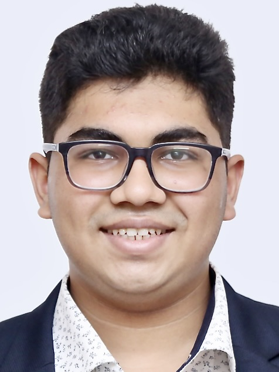

We are a team based in the [School of Computing, National University of Singapore](https://www.comp.nus.edu.sg).

You can reach us at the email `seer[at]comp.nus.edu.sg`

## Project team

### Nicholas Tang

[[github](https://github.com/nicholast1)]
[[portfolio](team/nicholas.md)]

* Role: Developer
* Role: Documentation

### William Nayar

[[github](http://github.com/wnayar)]
[[portfolio](team/wnayar.md)]

* Role: Project Developer 
* Responsibilities: Backend 

### Gabrielle Gianna Tan-Winings

[[github](http://github.com/gabriellegtw)] [[portfolio](team/gabriellegtw.md)]

* Role: Developer
* Responsibilities: Data

### Agarwal Ishan

[[github](http://github.com/ishan-agarwal-05)]
[[portfolio](team/ishan-agarwal-05.md)]

* Role: Developer
* Responsibilities: Testing

