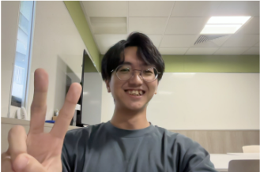

We are a team based in the [School of Computing, National University of Singapore](https://www.comp.nus.edu.sg).

You can reach us at the email `seer[at]comp.nus.edu.sg`

## Project team

### Abicharan Bhaskaran

[[homepage](http://www.comp.nus.edu.sg/~damithch)]
[[github](https://github.com/thenosewizard)]
[[portfolio](team/abicharan.md)]

* Role: Developer
* Responsibilities: Storage & Add supplier contact

### Chua Zhao Lin (Jasper)

[[github](http://github.com/ossaris56)]
[[portfolio](team/chuazhaolin.md)]

* Role: Developer
* Responsibilities: Storage

### Johnny Doe

[[github](http://github.com/johndoe)] [[portfolio](team/johndoe.md)]

* Role: Developer
* Responsibilities: Data

### Yan Hwee

[[github](https://github.com/yanhwee)]
[[portfolio](team/yanhwee.md)]

* Role: Developer
* Responsibilities: Storage, Contact

### Lim Jiale

[[github](http://github.com/jialegitgud)]
[[portfolio](team/jialegitgud.md)]

* Role: Deliverables and Deadlines, Scheduling and Tracking
* Responsibilities: In charge of Goods, Goods-Supplier Integrations
