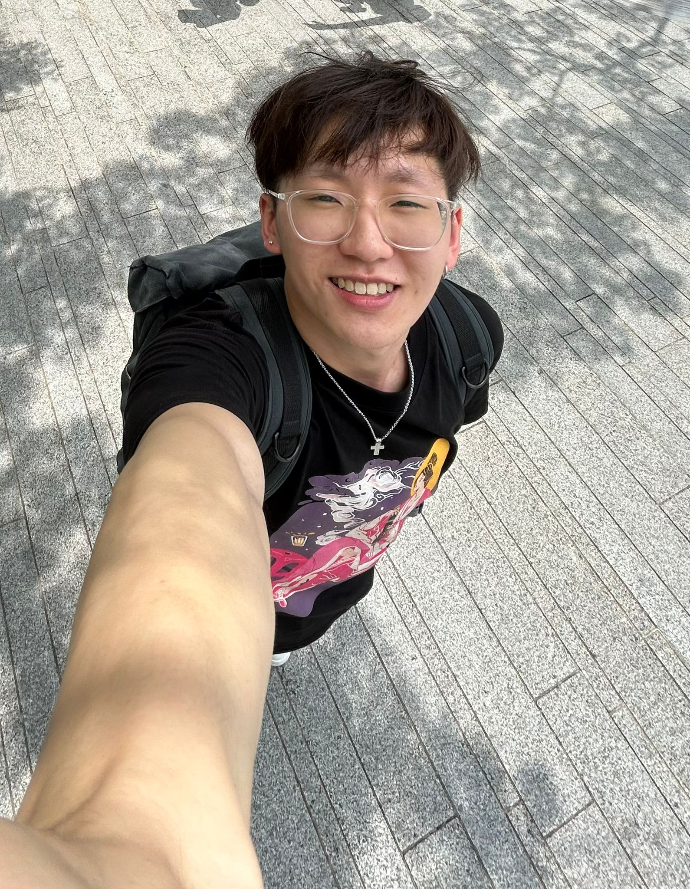

We are a team based in the [School of Computing, National University of Singapore](https://www.comp.nus.edu.sg).

You can reach us at the email `seer[at]comp.nus.edu.sg`

## Project team

### John Doe

[[homepage](http://www.comp.nus.edu.sg/~damithch)]
[[github](https://github.com/johndoe)]
[[portfolio](team/johndoe.md)]

* Role: Project Advisor

### Shane Tay

[[github](http://github.com/shantaa)]
[[portfolio](team/johndoe.md)]

* Role: Documentation
* Responsibilities: Responsible for the quality of various project documents.

### Justin Aw

[[github](http://github.com/Justin-Aw46)]
[[portfolio](team/johndoe.md)]

* Role: Developer
* Responsibilities: Testing

### Joshua Ng

[[github](http://github.com/AlphaPyke)]
[[portfolio](team/johndoe.md)]

* Role: Code Quality
* Responsibilities: Looks after code quality, ensures adherence to coding standards and git standards.

### James Doe

[[github](http://github.com/johndoe)]
[[portfolio](team/johndoe.md)]

* Role: Developer
* Responsibilities: UI
