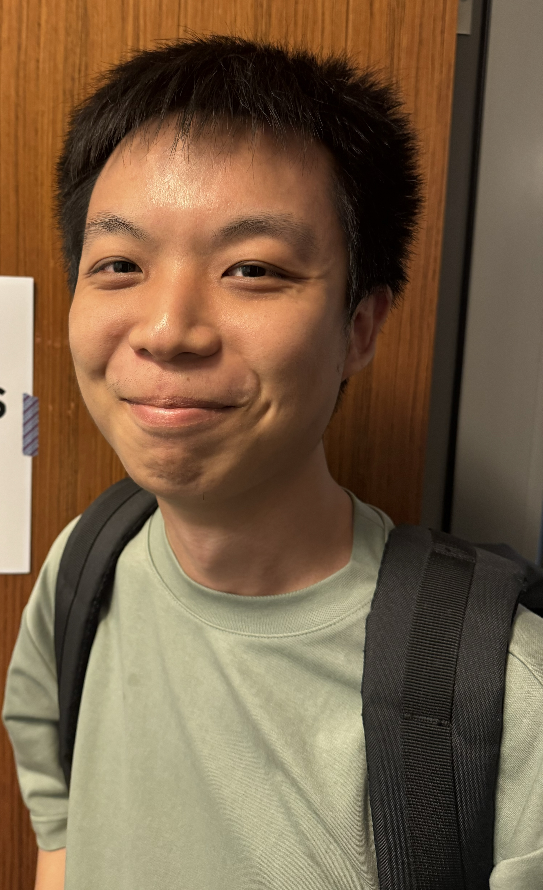
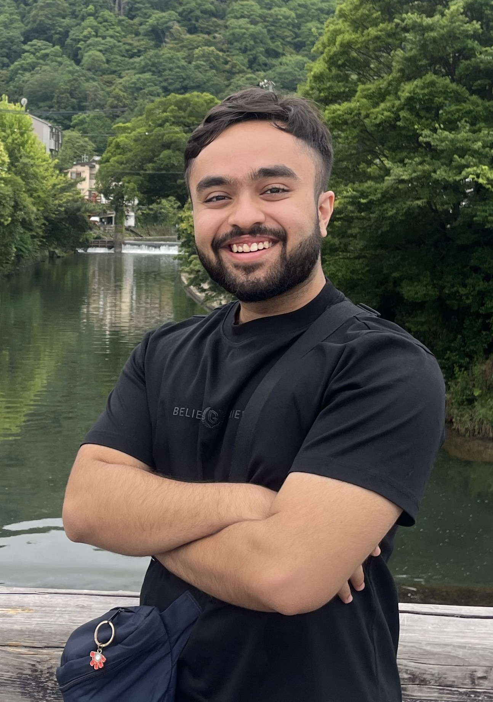
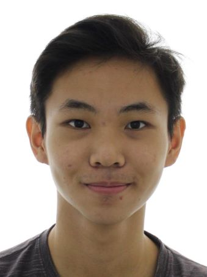
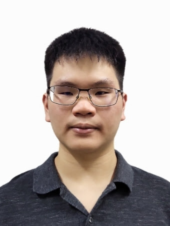
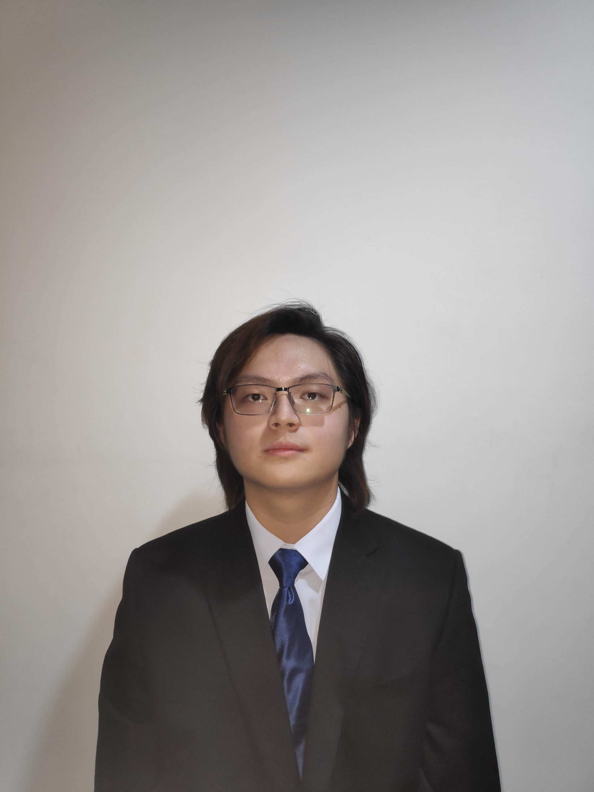

# About Us

We are a team based in the [School of Computing, National University of Singapore](http://www.comp.nus.edu.sg).

You can reach us at the email `seer[at]comp.nus.edu.sg`

## Project team

### Jaymeson Koh

[[github](https://github.com/blanklogic)]
[[portfolio](team/jaymeson.md)]

* Role: Team Lead
* Responsibilities: Integration, Testing, Code Quality

### Varun Shukla

[[github](http://github.com/Shux347)]
[[portfolio](team/varun.md)]

* Role: Product Manager
* Responsibilities: Scheduling and tracking, deliverables and deadlines

### Erwin Soh

[[github](http://github.com/meerkatboy)]
[[portfolio](team/erwin.md)]

* Role: Testing Lead, code quality, UI developer
* Responsibilities:
  * Ensure that testing of the project code is done regularly and sufficiently
  * Look after code quality to ensure that good coding standards and guidelines are adhered to
  * Work on developing the user interface for our user guide, ensuring a smooth and pleasant user experience

### Simon Tong

[[github](http://github.com/uniqly)]
[[portfolio](team/uniqly.md)]

* Role: Documentation Lead
* Responsibilities: Documentation, Testing, Code Quality

### Ang Qi Jun

[[github](http://github.com/realqijun)]
[[portfolio](team/qijun.md)]

* Role: UI Lead
* Responsibilities: UI, Documentation
