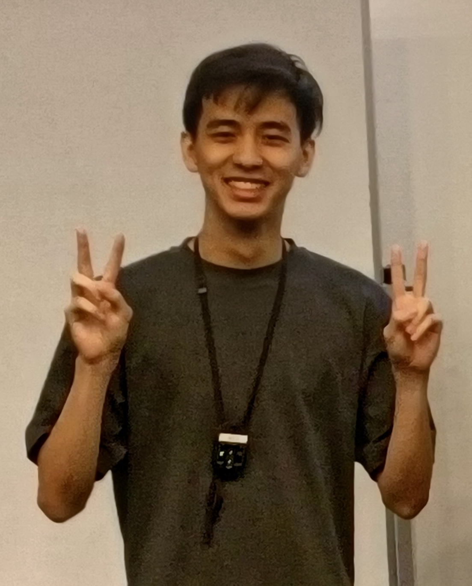
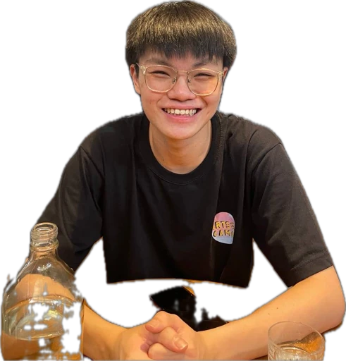
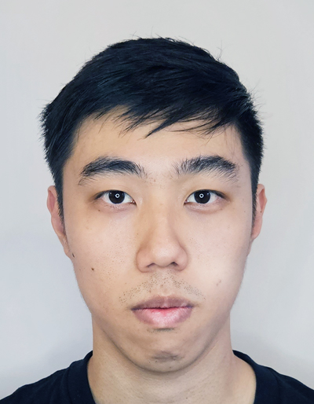
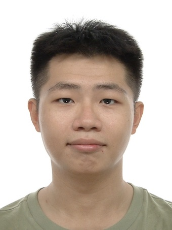

We are a team based in the [School of Computing, National University of Singapore](https://www.comp.nus.edu.sg).

You can reach us at the email `seer[at]comp.nus.edu.sg`

## Project team

### ALEK KWEK

[[github](https://github.com/AlekKwek18)]
[[portfolio](team/alekkwek18.md)]

* Role: Developer
* Responsibilities: Maintain and add features for contacts
* 
### BENJAMIN CHIN HAO NAN

[[github](https://github.com/Quasant)]
[[portfolio](team/quasant.md)]

* Role: Developer
* Responsibilities: TBC

### MAU ZE WEI

[[github](https://github.com/wassilililily)] 
[[portfolio](team/wassilililily.md)]

* Role: Developer
* Responsibilities: Integration: In charge of versioning of the code, maintaining the code repository, integrating various parts of the software to create a whole.

### SOO JUN BOON

[[github](https://github.com/Green-Tea-123)]
[[portfolio](team/green-tea-123.md)]

* Role: Developer
* Responsibilities: Add and maintain features for companies

### TOH KENG HIAN

[[github](https://github.com/KengHian)]
[[portfolio](team/kenghian.md)]

* Role: Developer
* Responsibilities: Code quality

