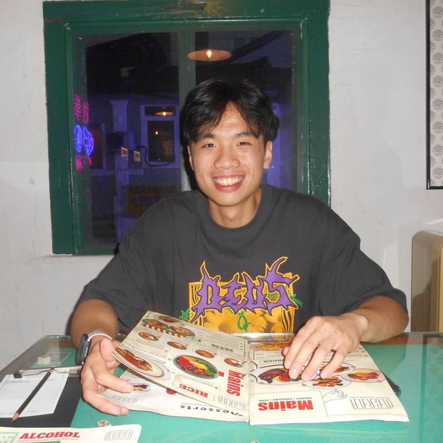
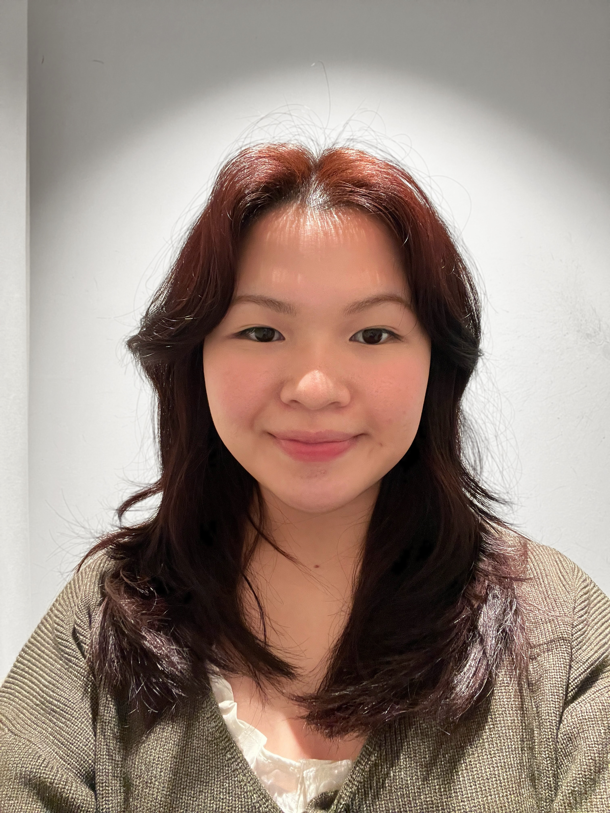
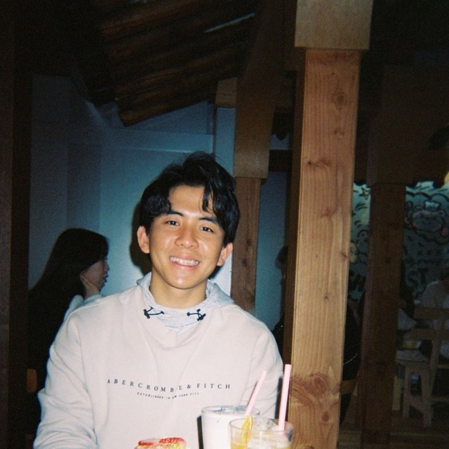
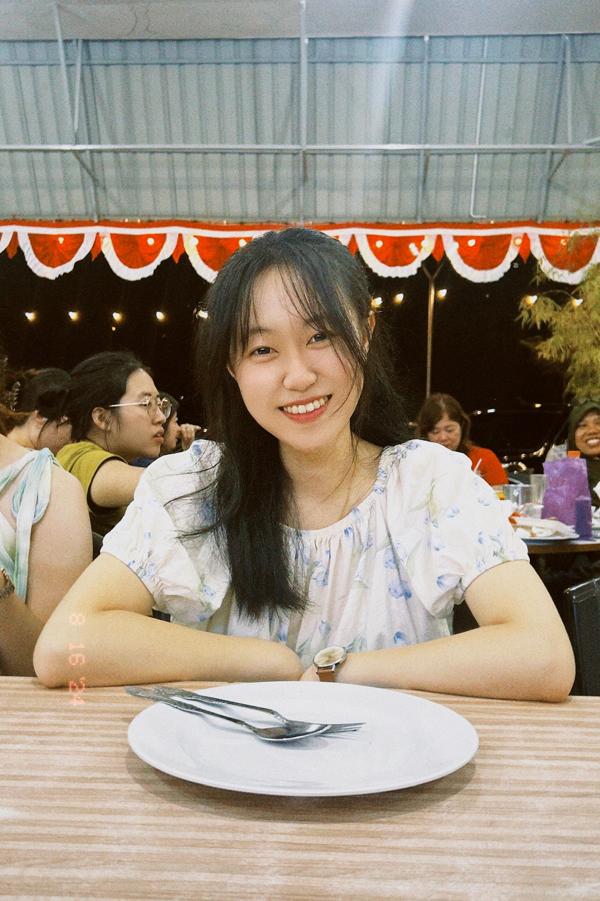

# About Us

We are a team based in the [School of Computing, National University of Singapore](http://www.comp.nus.edu.sg).

You can reach us at the email `seer[at]comp.nus.edu.sg`

## Project team

### John Doe

[[homepage](http://www.comp.nus.edu.sg/~damithch)]
[[github](https://github.com/jeremychiaaaa)]
[[portfolio](team/johndoe.md)]

* Role: Code Quality 

### Vera Koh

[[github](https://github.com/verakohh)]
[[portfolio](https://www.linkedin.com/in/verarkwj/)]

* Role: Team Lead
* Responsibilities: UI

### Johnny Doe

[[github](http://github.com/johndoe)] [[portfolio](team/johndoe.md)]

* Role: Developer
* Responsibilities: Data

### Tze Cheng

[[github](http://github.com/kuiktzecheng)]
[[portfolio](team/kuiktzecheng.md)]

* Role: Developer
* Responsibilities: Dev Ops + Threading

### Chen Le

[[github](https://github.com/chenle228)]
[[portfolio](https://github.com/chenle228)]

* Role: Developer
* Responsibilities: Deliverables and deadlines
