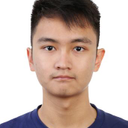
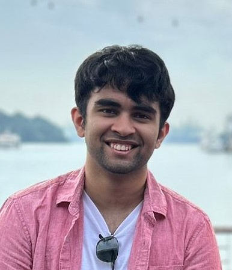
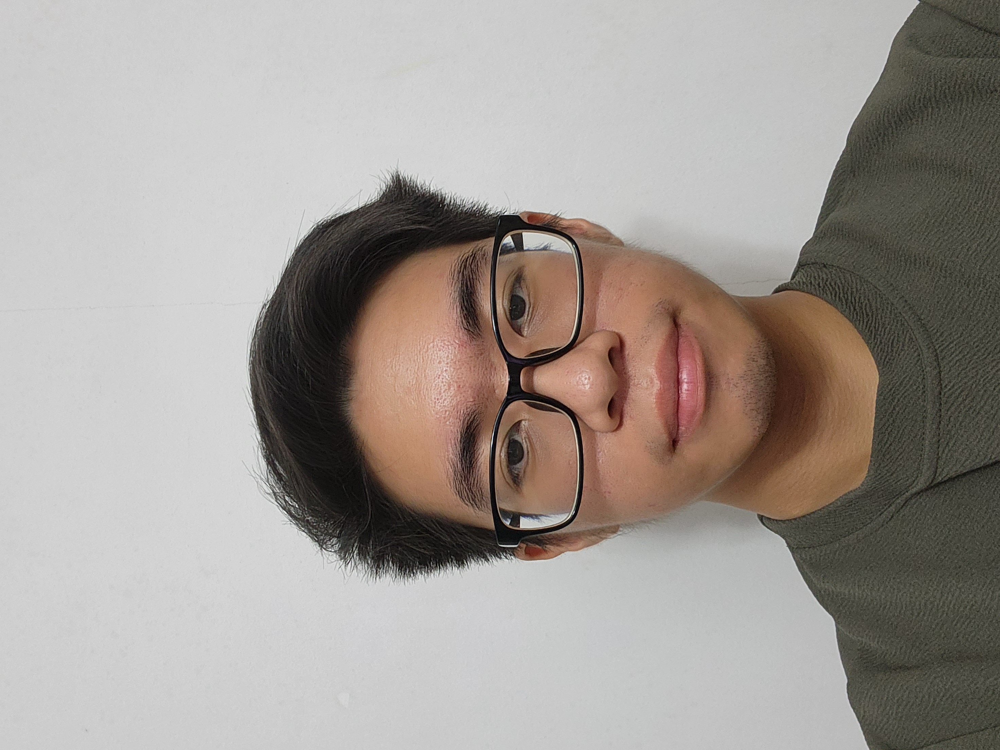

We are a team based in the [School of Computing, National University of Singapore](https://www.comp.nus.edu.sg).

You can reach us at the email `seer[at]comp.nus.edu.sg`

## Project team

### Yeo Bing Teck, George

[[github](https://github.com/george-yeo)]
[[portfolio](team/johndoe.md)]

* Role: Project Advisor
* Responsibilities: Features

### Atharva Tyagi

[[github](http://github.com/ty4g1)]
[[portfolio](team/johndoe.md)]

* Role: Team Lead
* Responsibilities: UI

### Soo Yi Tao

[[github](http://github.com/sooyitao)] [[portfolio](team/johndoe.md)]

* Role: Developer
* Responsibilities: Data

### Jean Doe

[[github](http://github.com/johndoe)]
[[portfolio](team/johndoe.md)]

* Role: Developer
* Responsibilities: Dev Ops + Threading

### James Doe

[[github](http://github.com/johndoe)]
[[portfolio](team/johndoe.md)]

* Role: Developer
* Responsibilities: UI
