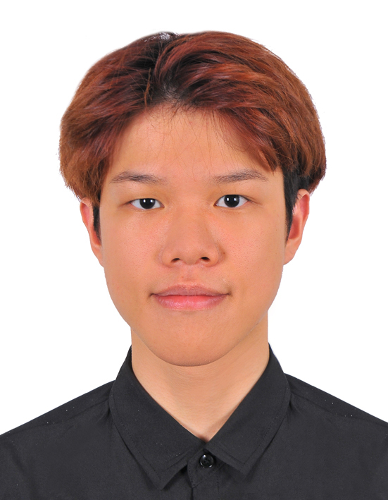
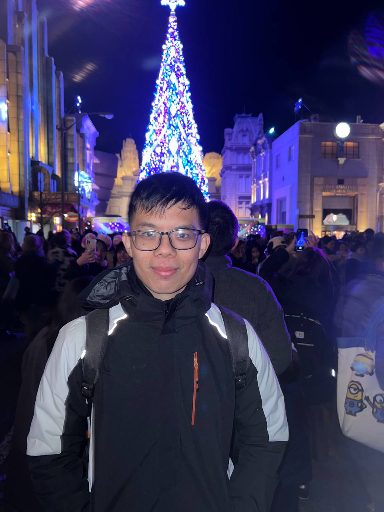
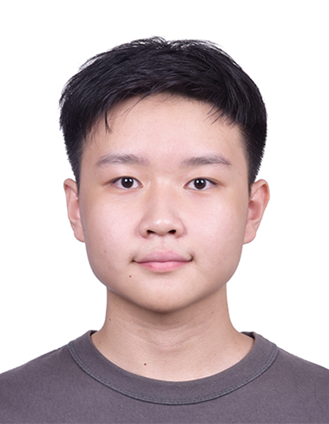
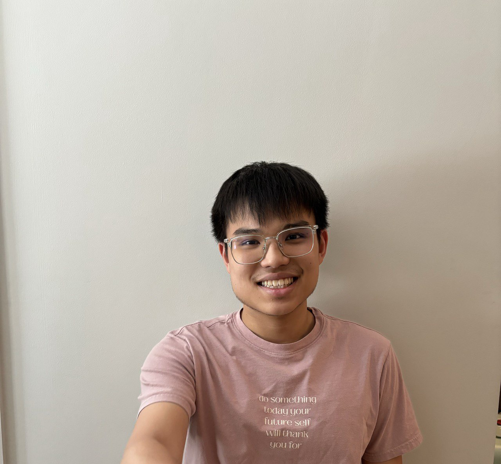
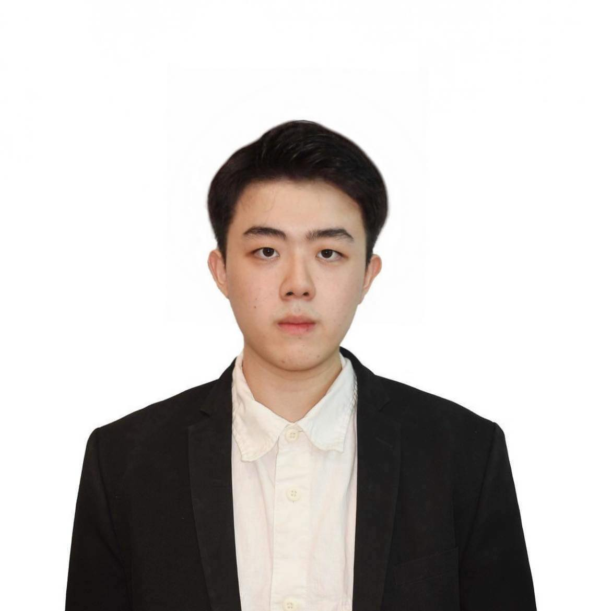

# About Us

We are a team based in the [School of Computing, National University of Singapore](http://www.comp.nus.edu.sg).

You can reach us at the email `seer[at]comp.nus.edu.sg`

## Project team

### Fui Jing Min

[[github](https://github.com/fui03)]
[[portfolio](team/johndoe.md)]

* Role: Project Developer
* Responsibilities: Integration and Testing

### Lo Yong Zhe

[[github](https://github.com/Reallyeasy1)]
[[portfolio](team/reallyeasy1)]

* Role: Software Engineer
* Responsibilities: Data

### Teh Wai Hong

[[github](http://github.com/waihongteh)]
[[portfolio](team/waihongteh.md)]

* Role: Team Lead
* Responsibilities: UI

### Tan San Chian

[[github](http://github.com/tansanchian)]
[[portfolio](team/tansanchian.md)]

* Role: Software Engineer
* Responsibilities: Backend Development

### Samson Chew Jun Jie

[[github](https://github.com/SamsonChew)]
[[portfolio](team/SamsonChew.md)]

* Role: Developer
* Responsibilities: UI
