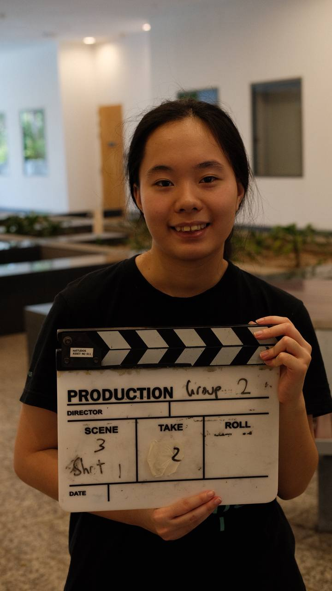
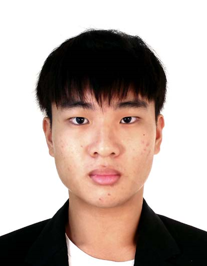
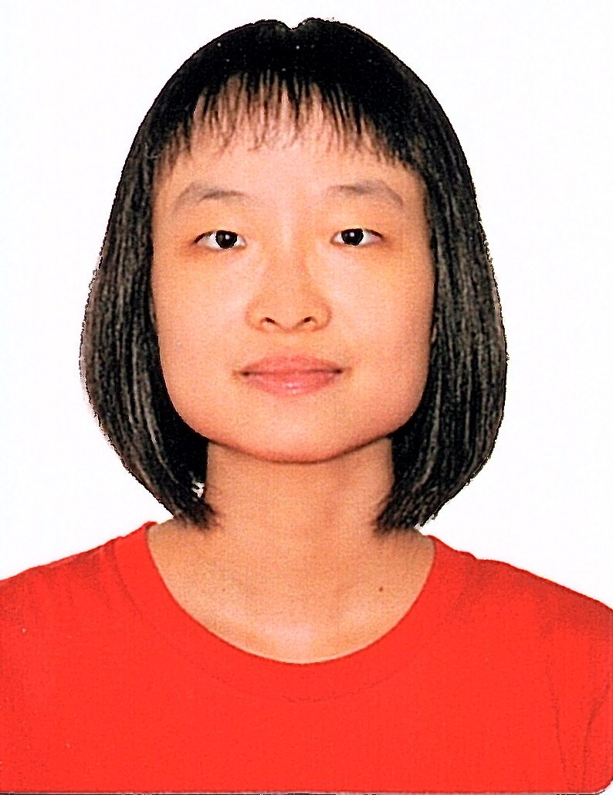

We are a team based in the [School of Computing, National University of Singapore](https://www.comp.nus.edu.sg).

You can reach us at the email `seer[at]comp.nus.edu.sg`

## Project team

### Kristia Ng

[[homepage](http://www.comp.nus.edu.sg/~damithch)]
[[github](https://github.com/kngys)]
[[portfolio](team/kngys.md)]

* Role: Developer, Code quality

### Teh Rui-Chun

[[homepage](https://nus-cs2103-ay2425s1.github.io/website)]
[[github](https://github.com/reginateh)]
[[portfolio](team/reginateh.md)]

* Role: Code quality, Integration

### Chin Kuan Jak

[[homepage](http://www.comp.nus.edu.sg/~damithch)]
[[github](https://github.com/darkmoongreatsword)]
[[portfolio](team/darkmoongreatsword.md)]

* Role: Developer
* Responsibilities: Testing 

### Tran Phuoc My

[[homepage](http://www.comp.nus.edu.sg/~trpmy)]
[[github](https://github.com/trpmy)]
[[portfolio](team/trpmy.md)]

* Role: Team lead, Deliverables and deadlines, Scheduling and tracking

### Si Rui

[[homepage](http://www.comp.nus.edu.sg/~damithch)]
[[github](http://github.com/beginner-web-developer)]
[[portfolio](team/beginner-web-developer.md)]

* Role: Documentation
* Responsibilities: Responsible for quality of project documents
