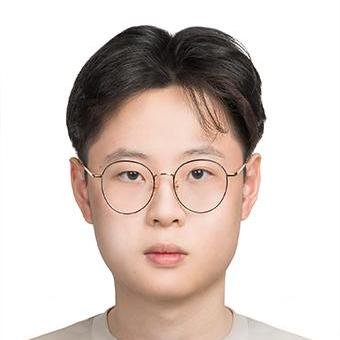

We are a team based in the [School of Computing, National University of Singapore](https://www.comp.nus.edu.sg).

You can reach us at the email `seer[at]comp.nus.edu.sg`

## Project team

### Presley Chew

[[github](https://github.com/PresleyChew)]

* Role: Project Advisor
* Responsibilities: Ensure task is on track
* About me: I am a year 2 Computer Science student who does a 2nd major in Psychology. When I am not coding, you can usually catch me at the Louis Vuitton store in Ion ;)

### Sivakumar Karthikraj

[[github](http://github.com/TechRaj)]
[[portfolio](team/TechRaj.md)]

* Role: Developer
* Responsibilities: Backend
* About me: I am a Year 2 Computer Science student who has in interest in SWE and AI/ML. When I am not coding, you can usually catch me cycling across Singapore or listen to some Rap.

### Ho Wei Nian

[[github](http://github.com/hweinian)]
[[portfolio](team/johndoe.md)]

* Role: Developer
* Responsibilities: Backend
* About me: I am a Year 2 Computer Science student who has in interest in SWE. 

