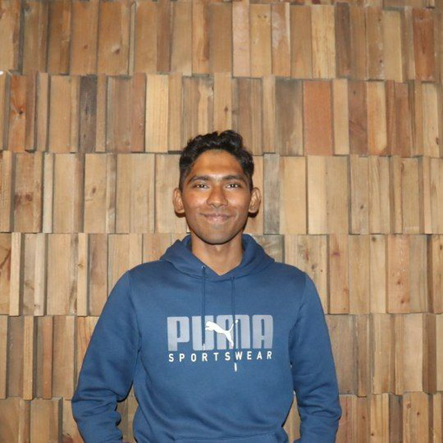
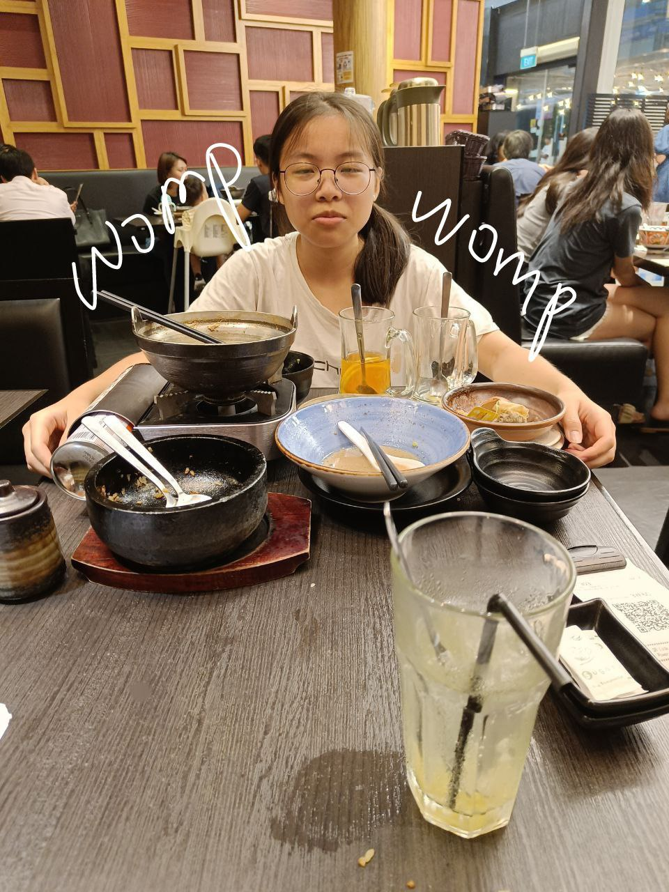
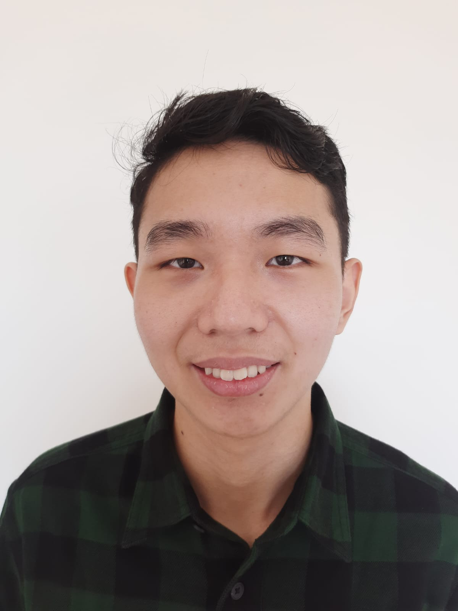
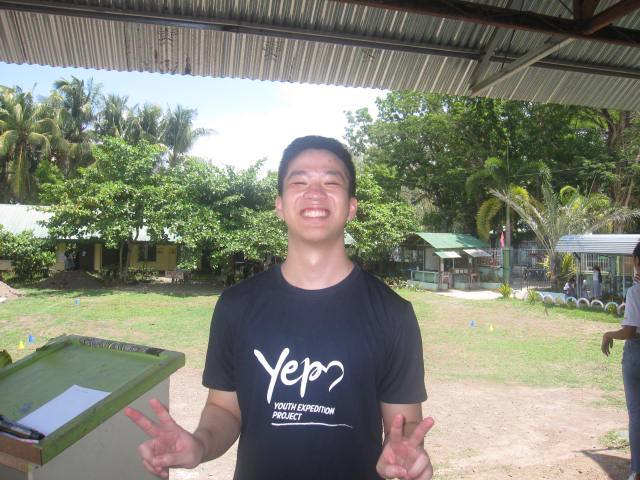

# About Us

We are a team based in the [School of Computing, National University of Singapore](http://www.comp.nus.edu.sg).

You can reach us at the email `seer[at]comp.nus.edu.sg`

## Project team

### P Shricharan

[[homepage](http://www.comp.nus.edu.sg/~damithch)]
[[github](https://github.com/psh12320)]
[[portfolio](team/AboutUs.md)]

- Role: Project Advisor

### Sankar Ram Subramanian

[[github](http://github.com/marraknas)]
[[portfolio](team/johndoe.md)]

* Role: Developer
* Responsibilities: Documentation

### Lin Xiner

[[github](http://github.com/xinghuajulia)] [[portfolio](team/johndoe.md)]

- Role: Developer
- Responsibilities: Data

### Ulrico Nolan Orlando

[[github](http://github.com/ulricolo7)]
[[portfolio](team/johndoe.md)]

- Role: Developer
- Responsibilities: Dev Ops + Threading

### Peter Hadi Wijaya

[[github](http://github.com/PeterHW963)]
[[portfolio](team/johndoe.md)]

- Role: Slacker
- Responsibilities: Nothing
