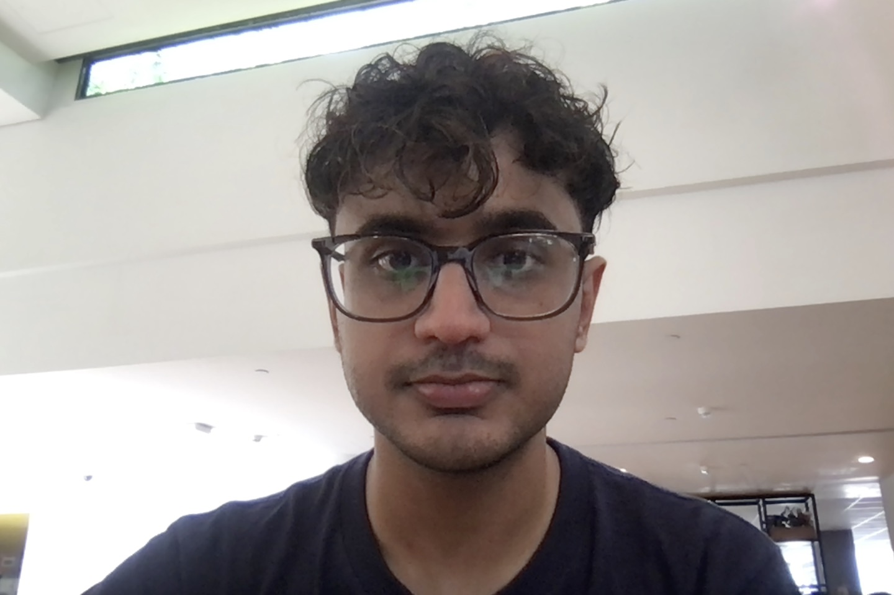
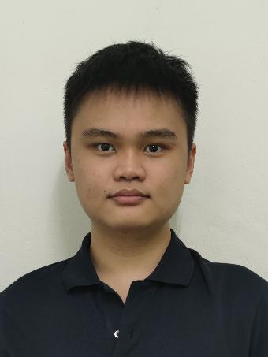
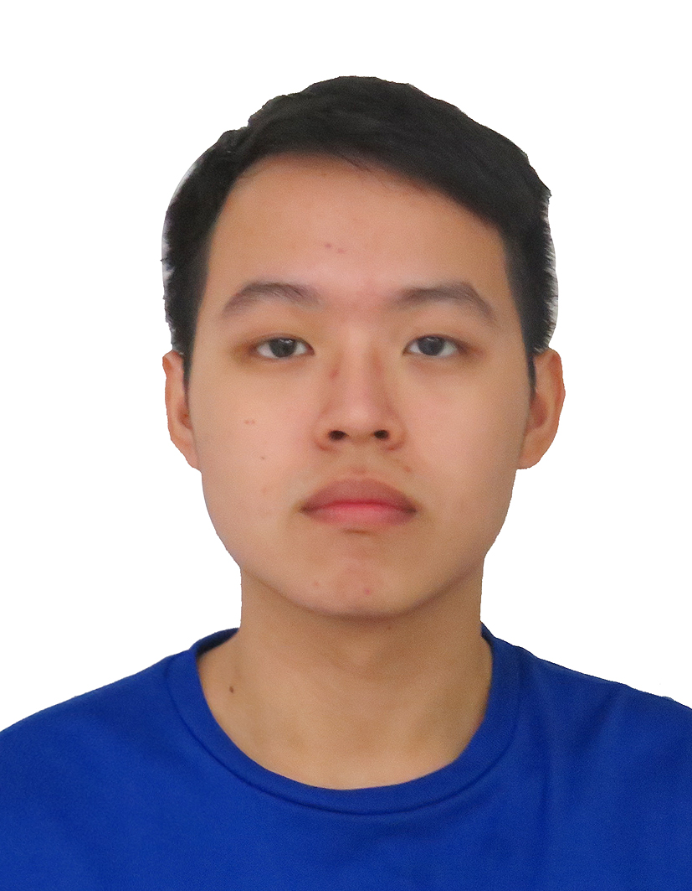
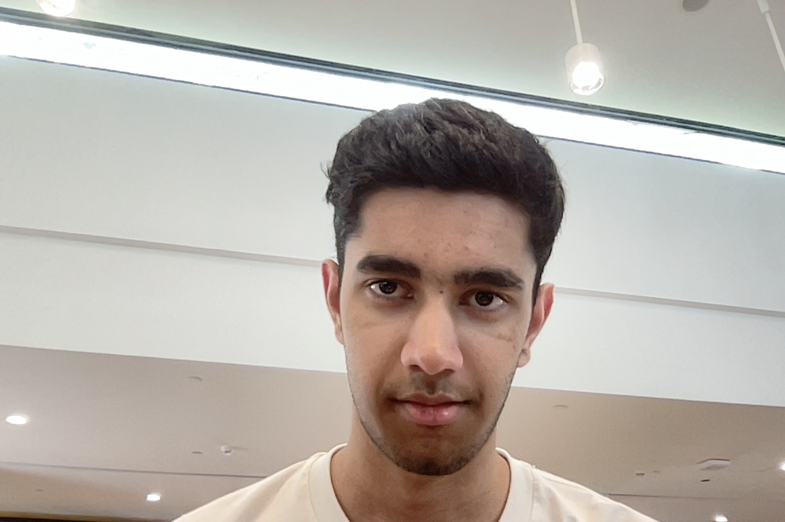

We are a team based in the [School of Computing, National University of Singapore](https://www.comp.nus.edu.sg).

You can reach us at the email `seer[at]comp.nus.edu.sg`

## Project team

### Tushar Tanwar

[[homepage](http://www.comp.nus.edu.sg/~damithch)]
[[github](https://github.com/tanwartushar)]

* Role: Project Advisor

### Rahul Agarwal

[[github](http://github.com/rahula1008)]
[[portfolio](http://linkedin.com/in/rahula1008)]

* Role: Developer
* Responsibilities: Data

### Jun Long

[[github](http://github.com/junlongling)] [[portfolio](https://www.linkedin.com/in/junlong-ling-030b55200/)]

* Role: Developer
* Responsibilities: Data

### Tang Jun Kiat

[[github](https://github.com/jktang14)]
[[portfolio](https://www.linkedin.com/in/tang-jun-kiat-0540582b6/)]

* Role: Developer
* Responsibilities: Dev Ops + Threading

### Prakamya Singh

[[github](https://github.com/Dinoman44)]
[[portfolio](https://prakamya-singh.vercel.app/)]

* Role: Developer - Testing, Code Quality
* Responsibilities: Commands, UI
