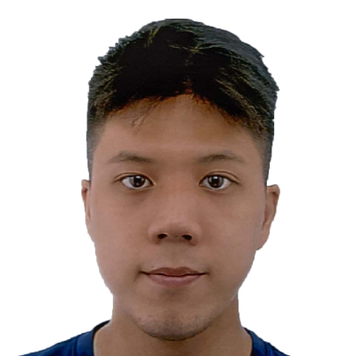
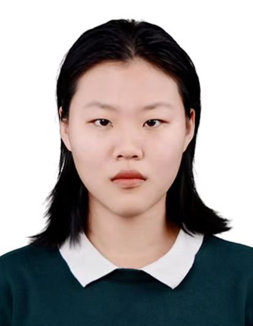
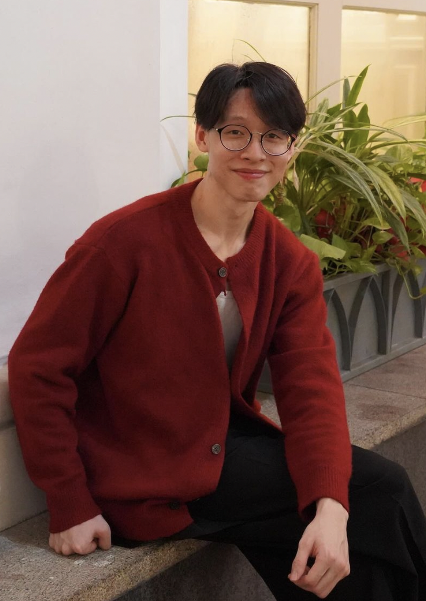
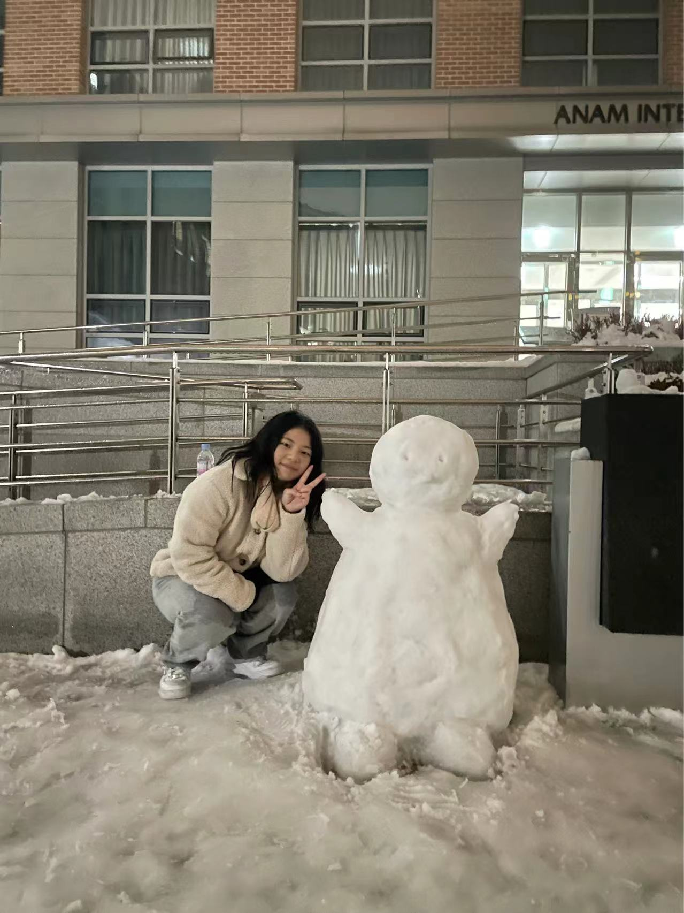

# About Us

We are a team based in the [School of Computing, National University of Singapore](http://www.comp.nus.edu.sg).

You can reach us at the email `seer[at]comp.nus.edu.sg`

## Project team

### Lewis Lye

[[github](http://github.com/ghos7ie)]
[[portfolio](team/ghos7ie.md)]

* Role: Developer
* Responsibilities: Documentation

### Wang Hongyanyan

[[github](http://github.com/YANYAN-w)]
[[portfolio](team/johndoe.md)]

* Role: Deliverables and deadlines
* Responsibilities: Ensure project deliverables are done on time and in the right format.

### Tan Soo Yap

[[github](https://github.com/SooYap)]
[[portfolio](team/johndoe.md)]

* Role: Developer and Testing
* Responsibilities: Dev Ops + Code Testing

### Desiree Sng

[[github](http://github.com/dez2003)]
[[portfolio](team/johndoe.md)]

* Role: Developer
* Responsibilities: Code Quality
