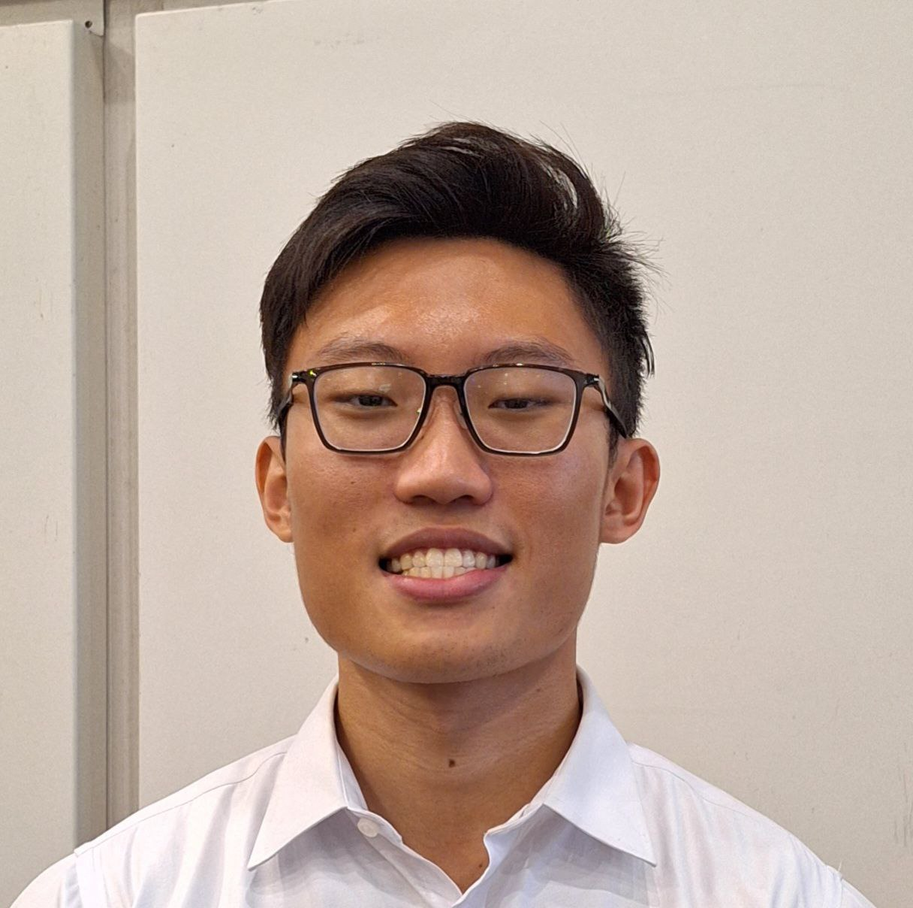
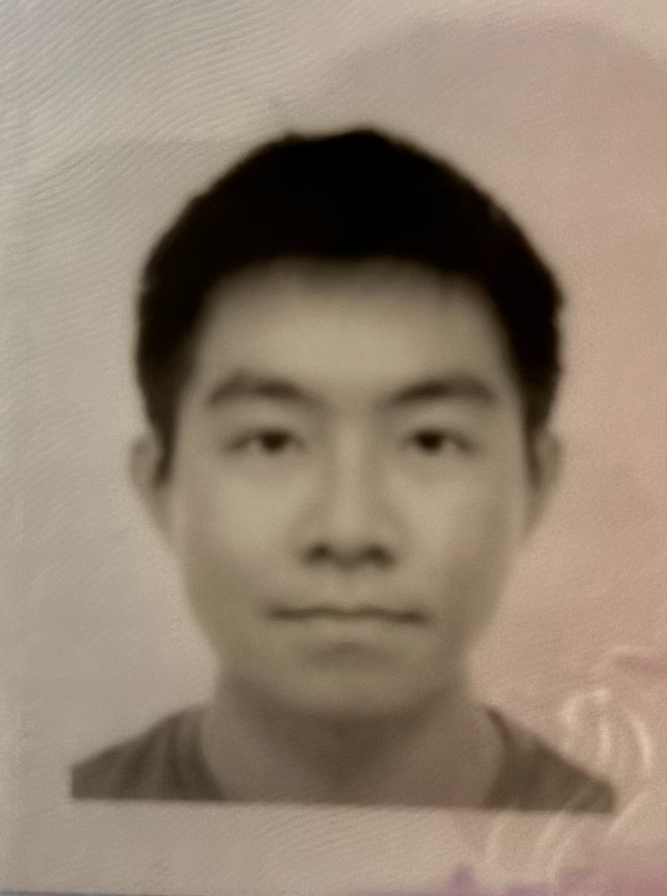
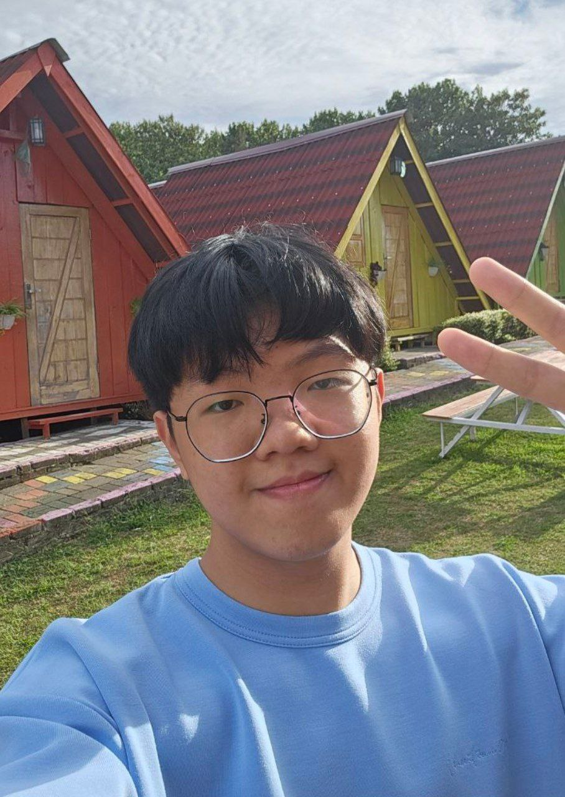
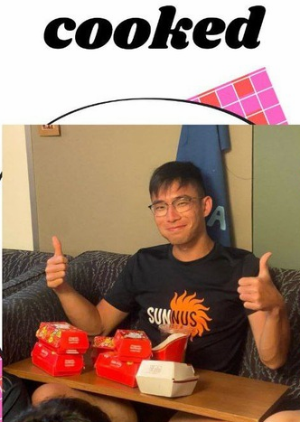

We are a team based in the [School of Computing, National University of Singapore](https://www.comp.nus.edu.sg).

You can reach us at the email `seer[at]comp.nus.edu.sg`

## Project team

### Ng Zi Xin

[[github](https://github.com/ngzixin)]
[[portfolio](team/ngzixin.md)]

* Role: Code Quality Checker
* Responsibilities: Check Code Quality

### Chin Yi Ling

[[github](https://github.com/ylchin)]
[[portfolio](team/ylchin.md)]

* Role: Deliverables and deadlines
* Responsibilities: Project deliverables
*
### Ng Eswen

[[github](https://github.com/Solomon0519)]
[[portfolio](team/Eswen.md)]

* Role: Documentation
* Responsiblities: Check proper documentation

### Kenny Lewi

[[github](http://github.com/kennylewi)]
[[portfolio](team/kennylewi.md)]

* Role: Testing
* Responsibilities: Ensures the testing of the project is done properly and on time

### Yiow Meng Loong

[[github](http://github.com/creditablex)]
[[portfolio](team/creditablex.md)]

* Role: Team Lead
* Responsibilities: Lead Team
