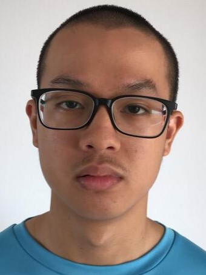

We are a team based in the [School of Computing, National University of Singapore](https://www.comp.nus.edu.sg).

You can reach us at the email `seer[at]comp.nus.edu.sg`

## Project team

### John Doe

[[homepage](http://www.comp.nus.edu.sg/~damithch)]
[[github](https://github.com/johndoe)]
[[portfolio](team/johndoe.md)]

- Role: Project Advisor

### Jane Doe

[[github](http://github.com/johndoe)]
[[portfolio](team/johndoe.md)]

- Role: Team Lead
- Responsibilities: UI

### Lee Ze Hao

[[github](http://github.com/leezehao)] [[portfolio](team/leezehao.md)]

* Role: Documentation
* Responsibilities: Ensuring completeness and tidiness of all project documentation.

### Joshua Loh

[[github](http://github.com/professional-procrastinat0r)]
[[portfolio](team/professional-procrastinat0r.md)]

* Role: Testing
* Responsibilities: Ensures the testing of the project is done properly and on time.

### Samuel Foo

[[github](http://github.com/samuelfoo)]
[[portfolio](team/samuelfoo.md)]

- Role: Integration
- Responsibilities: In charge of versioning of the code, maintaining the code repository, integrating various parts of the software to create a whole.
