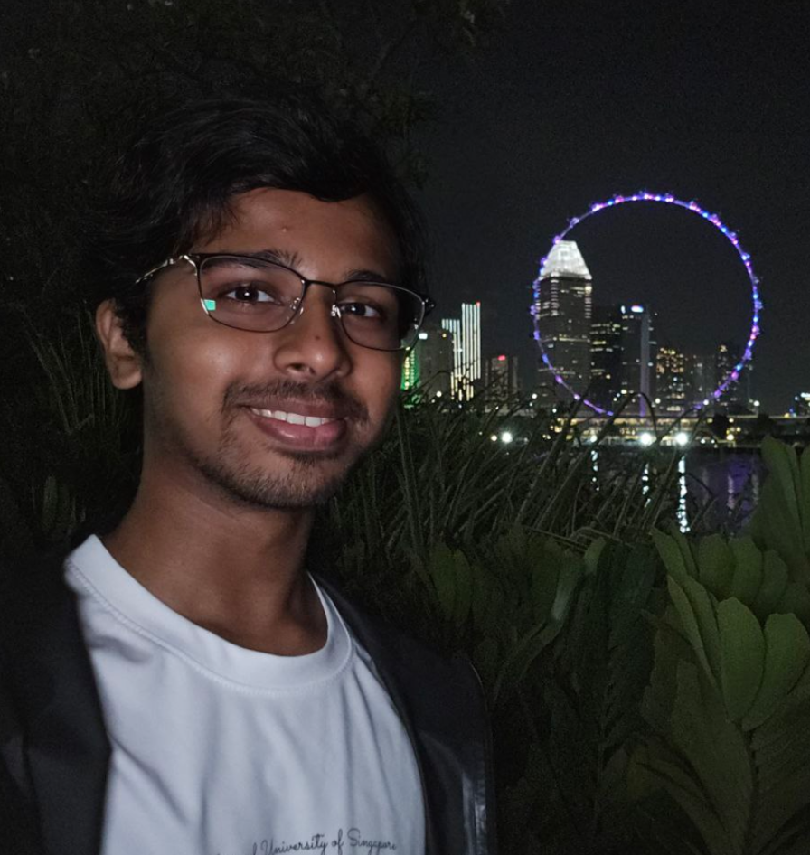
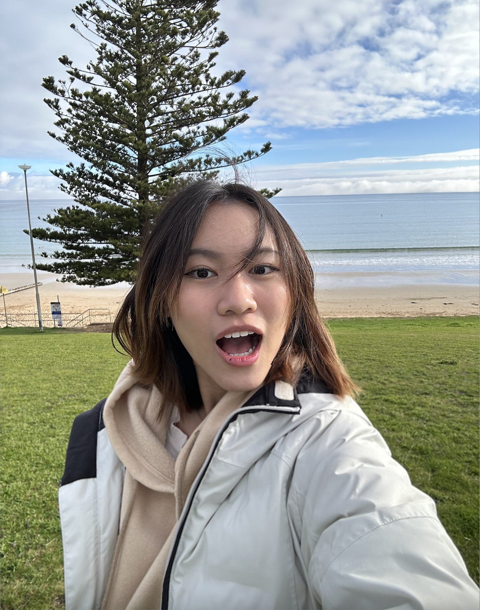
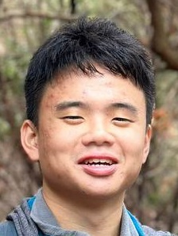
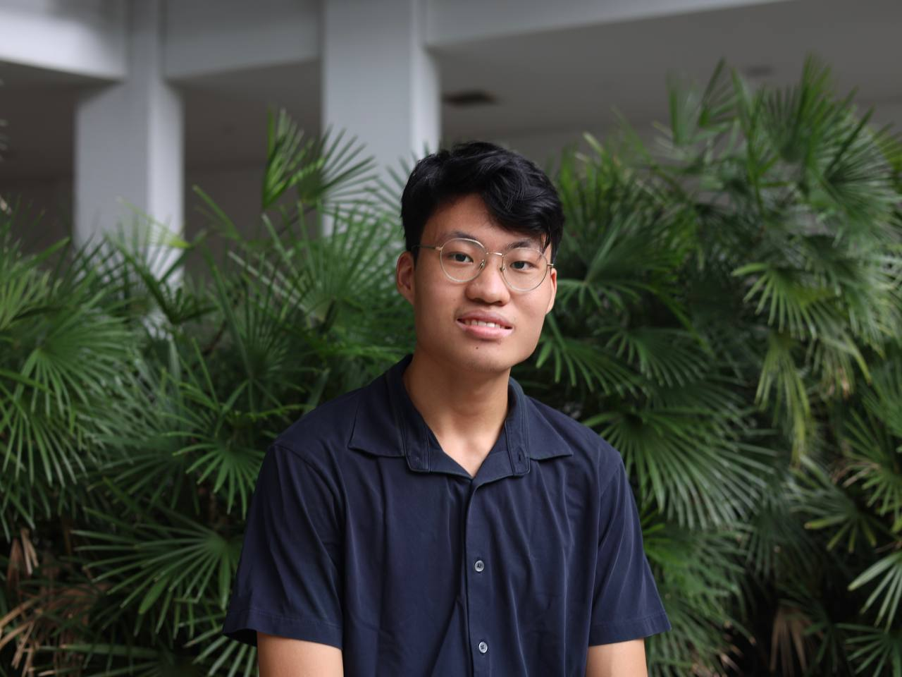

We are a team based in the [School of Computing, National University of Singapore](https://www.comp.nus.edu.sg).

You can reach us at the email `seer[at]comp.nus.edu.sg`

## Project team

### Aaron Rodrigues

[[homepage](http://www.comp.nus.edu.sg/~damithch)]
[[github](https://github.com/runus01)]
[[portfolio](team/runus01.md)]

* Role: Tester and Pet Manager
* Responsibilities: Ensures proper and timely testing of the software while managing the project's pet-related features.

### Clarissa

[[github](http://github.com/clarissatjx)]
[[portfolio](team/johndoe.md)]

* Role: Team Lead
* Responsibilities: In charge of Search

### David Goh

[[github](https://github.com/daivdgohzk)] [[portfolio](team/johndoe.md)]

* Role: Documentation and Code Quality
* Responsibilities: Co-incharge of Pet Owner

### Jonathan Loh

[[github](https://github.com/jloh02)]
[[portfolio](team/johndoe.md)]

* Role: Integration
* Responsibilities: In Charge of Pet Owner

### Jordan Chan

[[github](http://github.com/naythee169)]
[[portfolio](team/johndoe.md)]

* Role: Deliverables & Deadlines, Scheduling & Tracking
* Responsibilities: 
* - Ensure project deliverables are done on time and in the right format.
* - In charge of defining, assigning and tracking project tasks
