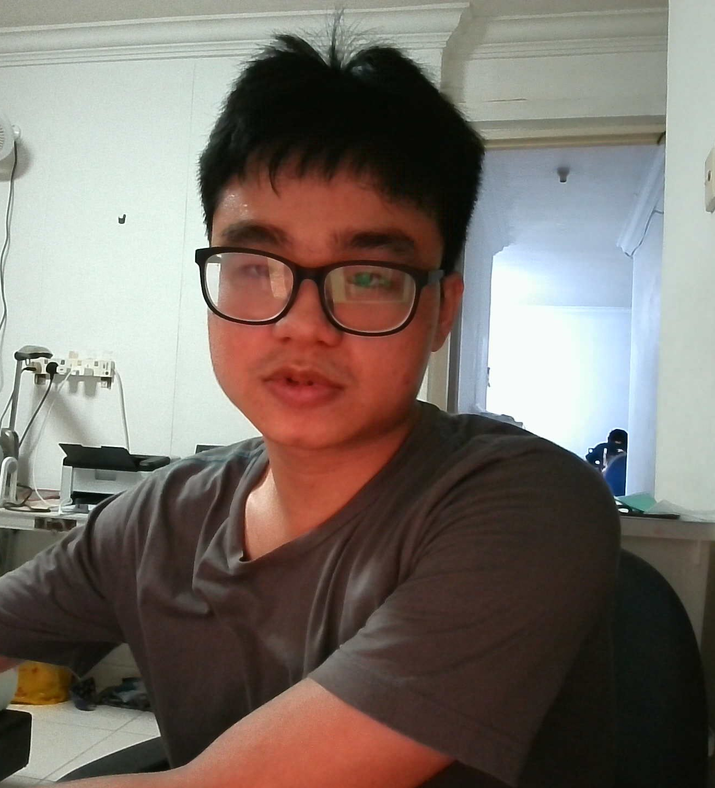
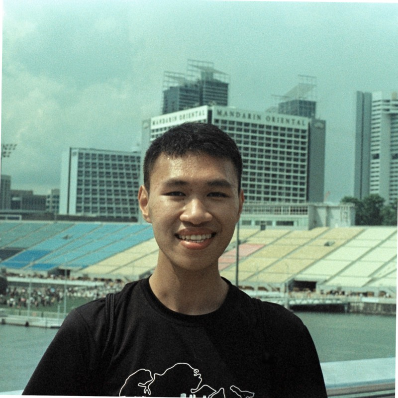
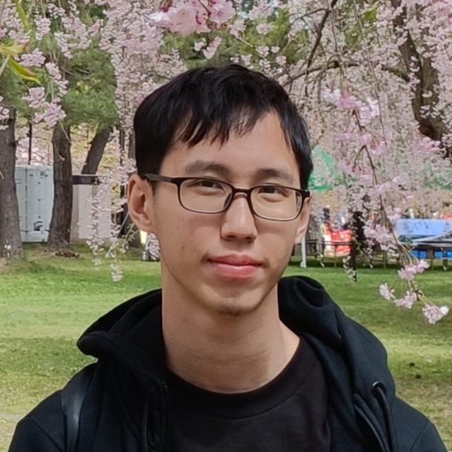

# About Us

We are a team based in the [School of Computing, National University of Singapore](http://www.comp.nus.edu.sg).

You can reach us at the email `seer[at]comp.nus.edu.sg`

## Project team

### Lim Kai Xuan

[[github](https://github.com/kaixuan477)]
[[portfolio](team/kaixuan477)]

* Role: Developer
* Responsibilities: Code Quality

### Foo Chao

[[github](http://github.com/FooChao)]
[[portfolio](team/FooChao.md)]

* Role: Developer
* Responsibilities: UI

### Yu Sutong

[[github](http://github.com/yu-sutong)] [[portfolio](team/yu-sutong.md)]

* Role: Team Lead
* Responsibilities: Data

### Ng Kheng Yang

[[github](https://github.com/awdse22)]
[[portfolio](team/khengyang.md)]

* Role: Developer
* Responsibilities: Dev Ops + Threading
