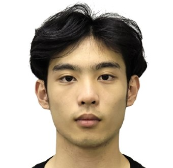
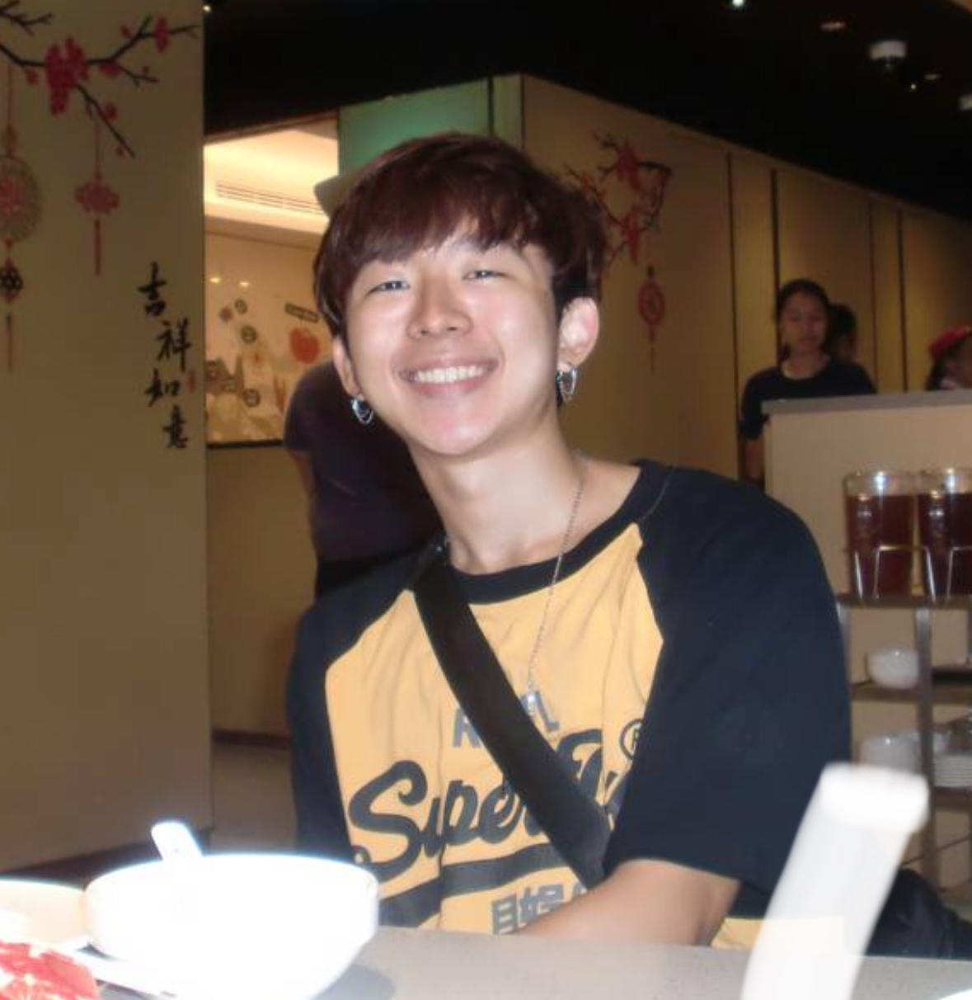
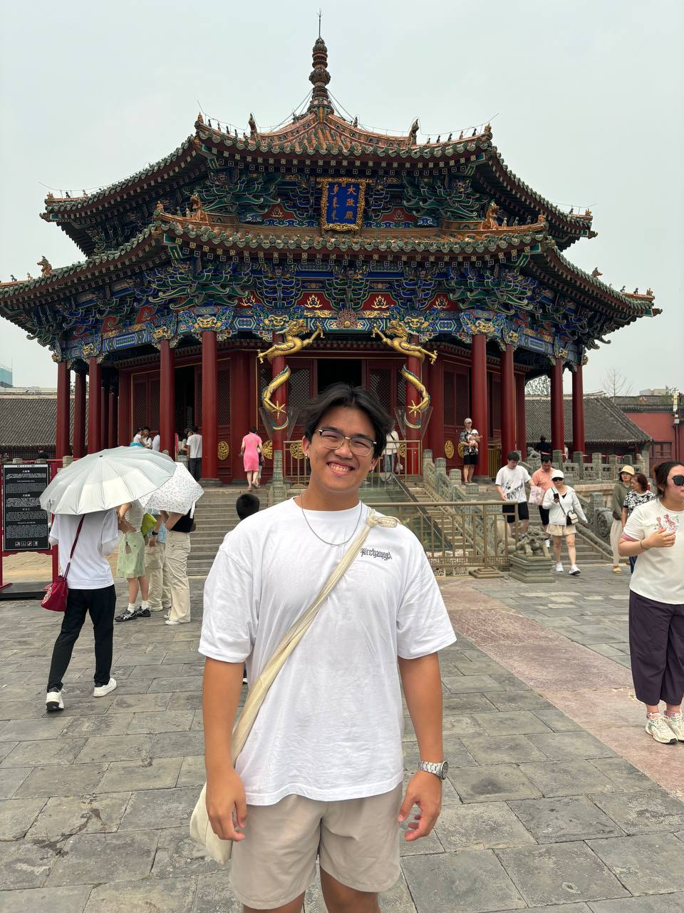

We are a team based in the [School of Computing, National University of Singapore](https://www.comp.nus.edu.sg).

You can reach us at the email `seer[at]comp.nus.edu.sg`

## Project team

### Ho Cheok Wai, Sherman

[[homepage](http://www.comp.nus.edu.sg/~damithch)]
[[github](https://github.com/itsnotsherm)]
[[portfolio](team/johndoe.md)]

- Role: Developer
- Responsibilities: Project Management

### Dominic Khoo

[[github](http://github.com/Dominic-Khoo)]
[[portfolio](team/johndoe.md)]

- Role: Team Lead
- Responsibilities: UI

### Reiden Ong

[[github](http://github.com/reidenong)]
[[portfolio](team/johndoe.md)]

- Role: Developer
- Responsibilities: Data

### Lim Juntong

[[github](http://github.com/lim-jt)]
[[portfolio](team/johndoe.md)]
- Role: Developer
- Responsibilities: Dev Ops + Threading

### Zhang Yuan

[[github](http://github.com/volleyballkickedme)]
[[portfolio](team/johndoe.md)]
* Name: Zhang Yuan
* Role: Developer
* Responsibilities: UI
