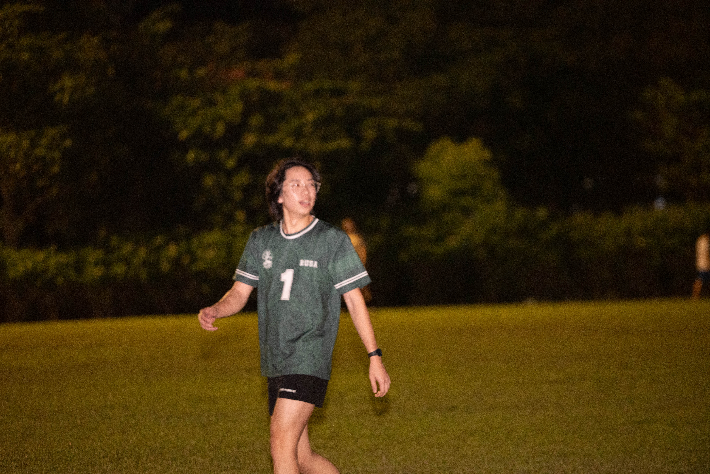
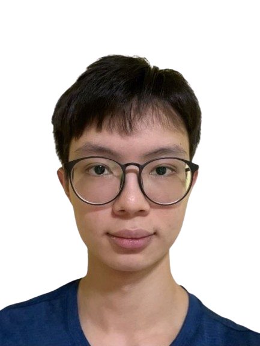
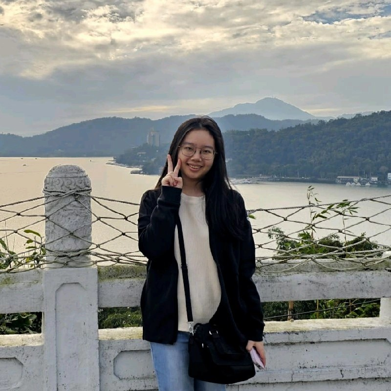
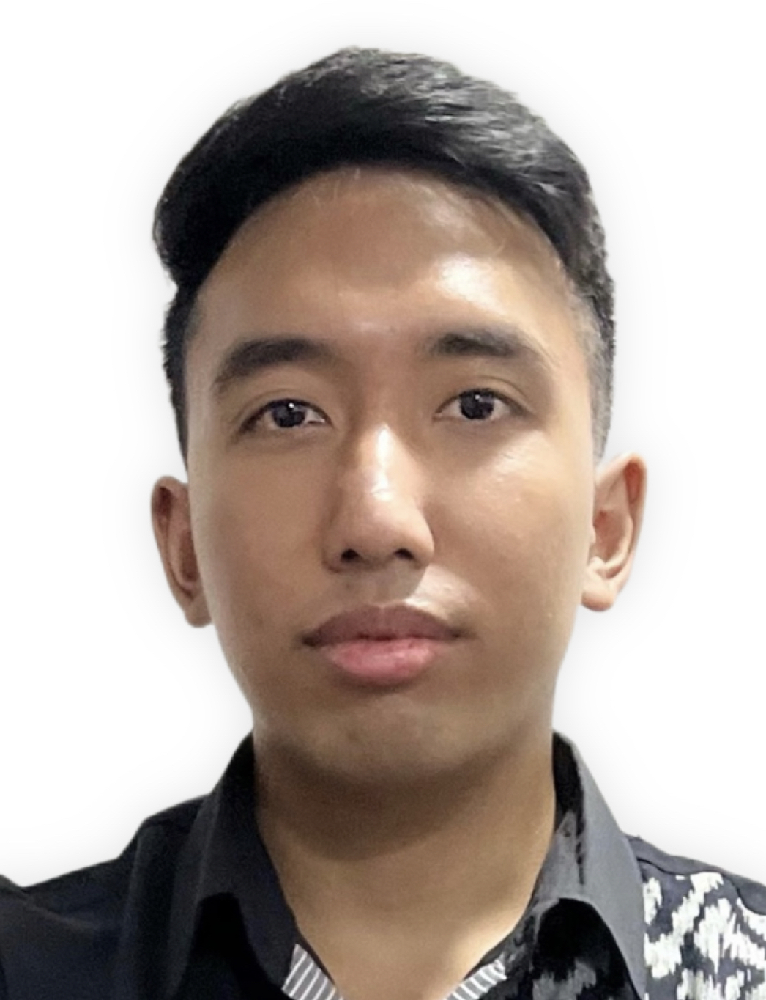

We are a team based in the [School of Computing, National University of Singapore](https://www.comp.nus.edu.sg).

You can reach us at the email `seer[at]comp.nus.edu.sg`

## Project team

### Anselm Long

[[github](https://github.com/anselmlong)]
[[portfolio](team/anselmlong.md)]

* Role: Team Lead
* Responsibilities: Deliverables and deadlines, Tracking and scheduling

### Leroy Tan

[[github](https://github.com/leroytan)]
[[portfolio](team/leroytan.md)]

* Role: Developer
* Responsibilities: General + Testing

### Rachel Yeo Hui Min

[[github](http://github.com/rachelyeohm)]
[[portfolio](team/rachelyeohm.md)]

* Role: Developer
* Responsibilities: General Software Responsibilities

### Raihan Rizqullah

[[github](https://github.com/raihahahan)]
[[portfolio](team/raihahahan.md)]

* Role: Developer
* Responsibilities: General Software Development | Assist Team Members with technical issues
