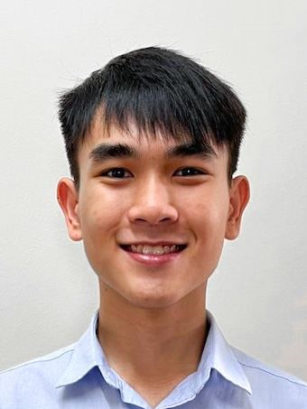
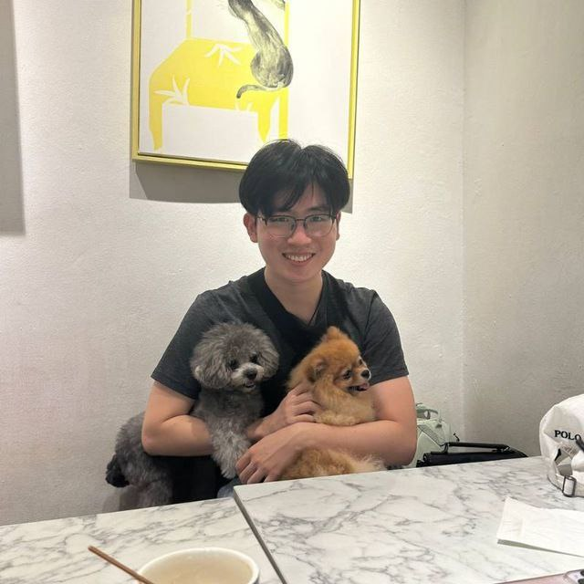
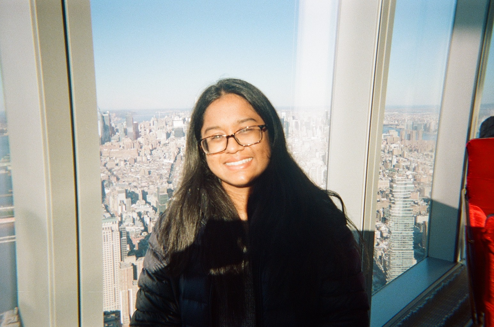
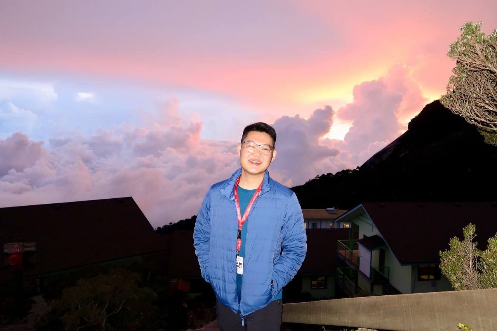
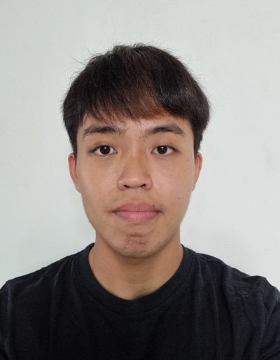

# About Us

We are a team based in the [School of Computing, National University of Singapore](http://www.comp.nus.edu.sg)

Our team name is CS2103-F12-4.

You can reach us at the email `seer[at]comp.nus.edu.sg`

## Project team

### Teng Wei Loon

[[github](https://github.com/bunnyhoppp)]
[[portfolio](team/bunnyhoppp.md)]

* Role: Developer
* Responsibilities: Testing

### Tan ZiYang Henry

[[github](http://github.com/tanziyanghenry)]
[[portfolio](team/tanziyanghenry.md)]

* Role: Developer
* Responsibilities: UI

### Murali Shruthi

[[github](https://github.com/shruthiiii03)]
[[portfolio](team/shruthiiii03.md)]

* Role: Developer
* Responsibilities: UI

### Goh Qing Khang

[[github](http://github.com/gohqingkhang)] [[portfolio](team/gohqingkhang.md)]

* Role: Developer
* Responsibilities: Data

### Jason Chuah

[[github](http://github.com/jason-chuah)]
[[portfolio](team/jason-chuah.md)]

* Role: Developer
