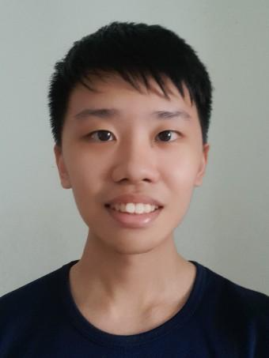
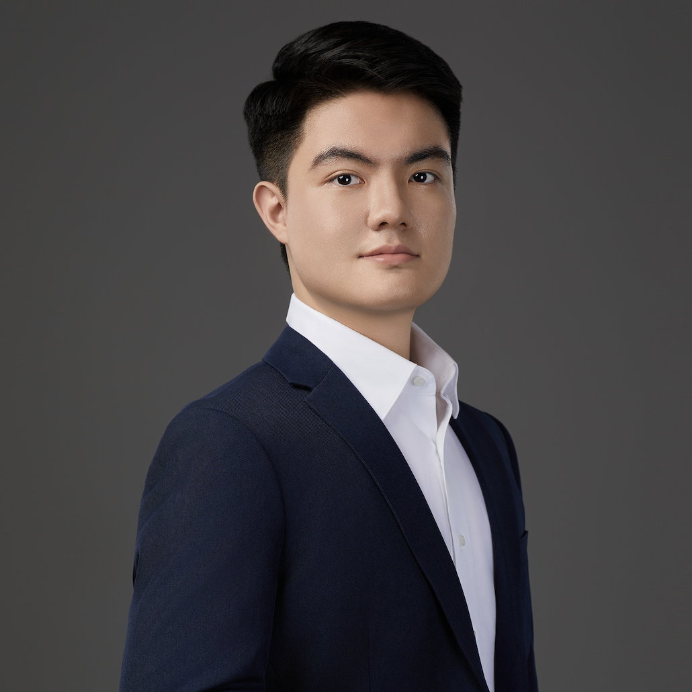
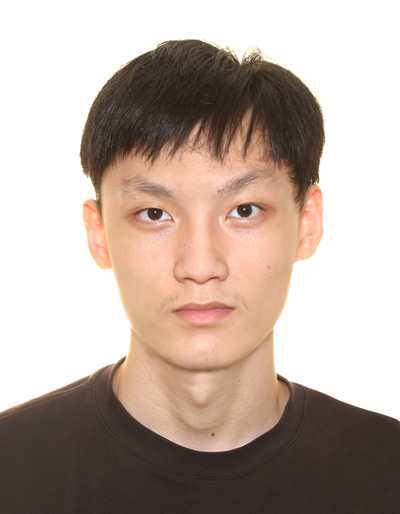

We are a team based in
the [School of Computing, National University of Singapore](https://www.comp.nus.edu.sg).

You can reach us at the email `seer[at]comp.nus.edu.sg`

## Project team

### Goh Yong Jing

[[email](e0693145@u.nus.edu)]
[[LinkedIn](https://www.linkedin.com/in/yong-jing-goh-948605219/)]
[[Github](https://github.com/gohyongjing)]

- Role: Project Advisor

### See Yang Zhi

[[homepage](https://yangzhi.dev)]
[[github](https://github.com/SeeYangZhi)]
[[portfolio](team/seeyangzhi.md)]

- Role: Team Lead
- Responsibilities:
    - Scheduling and tracking
      - In charge of defining, assigning, and tracking project tasks.
    - Deliverables and deadlines
      - Ensure project deliverables are done on time and in the right format.
    - Documentation
      - Responsible for the quality of various project documents.

### Sean Lim

[[github](http://github.com/seanlim)] [[bsky](https://seanlkx.bsky.social/)]

- Role: In charge of `Model`, Code Quality
- Responsibilities:
    - Manage the models we will use for SpleetWaise.
    - Code Reviews to uphold coding standards.

### Dong Qianbo

[[github](http://github.com/rollingpencil)]

- Role: In charge of `Storage`, Integration
- Responsibilities:
    - Ensure data format are consistent.
    - In charge of versioning of the code, maintaining the code repository, and
      integrating various parts of the software to create a whole.

### He Yiheng

[[github](http://github.com/Dino-Nuggies)]

- Current role: In charge of `Logic`
- Responsibilities: 
  - Act as the gatekeeper of quality for `Logic` component

### Gavin Sin

[[github](http://github.com/gavinsin)]

- Role: In charge of `UI`, Testing
- Responsibilities: Manage the UI for SpleetWaise to ensure consistency. Code
  Testing to ensure bug-free application.
